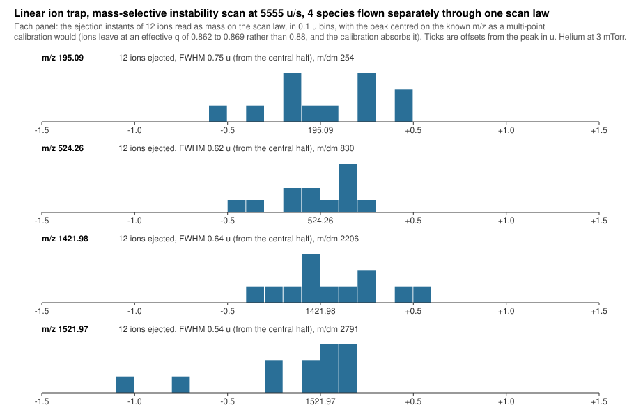

# Device templates

A device template is a model document with a declared parameter surface. It is
**data**, not code — embedded JSON in `Einzel.Library/Templates/`.

That is the whole of LIB-1, and the test it sets is sharp: if supporting a new
device requires a change below `Einzel.Library`, either it is genuinely novel
physics or the abstraction is wrong, and almost always the second.

## What ships

| Template | What it is |
| --- | --- |
| `planar-mirror-pair` | **A compact Astral-type analyser**: two printed-circuit ion mirrors facing each other, solved across the board gap and reflected to make the pair. The same class of instrument as `astral-3d` below: an asymmetric-track multi-reflection time-of-flight analyser, at a compact scale |
| `quadrupole` | Four round rods in cross-section, alternating potential |
| `rectilinear-trap` | Four flat plates around a square aperture, the front one split by an extraction slot |
| `einzel-lens` | Three coaxial tubes, outer two earthed, solved axisymmetrically |
| `quadrupole-rf` | The same four rods, driven: a mass filter |
| `ion-funnel` | A tapering stack of RF rings with a DC gradient, written as one ring repeated |
| `segmented-quadrupole` | Three axial sections at their own working points, solved in three dimensions |
| `travelling-wave-guide` | A ring stack whose drive phase ramps along it, so the potential travels |
| `multipole-guide` | Any even order — quadrupole, hexapole, octupole, and beyond — from one file |
| `paul-trap` | A driven ring between two earthed endcaps: the three-dimensional quadrupole trap, solved axisymmetrically |
| `kingdon-trap` | A wire on the axis of a cylinder: the electrostatic orbital trap, and the ancestor of the Orbitrap |
| `orbital-trap` | A quadro-logarithmic field: ions circle a spindle while oscillating along it, and the axial frequency is the measurement |
| `c-trap` | Four rods bent around an arc: the curved RF trap that injects an orbital analyser |
| `pnnl-ion-funnel` | The published PNNL 100-electrode funnel, as built to a literature benchmark: Kim 2000's transmission against RF amplitude and Page 2006's low-m/z cutoff |
| `linear-ion-trap` | The radial-ejection linear ion trap of Schwartz, Senko and Syka (2002) in cross-section: hyperbolic rods as polygons, a 0.25 mm ejection slot, the x pair stretched 0.75 mm, main RF and a dipole excitation on two generators, helium |
| `stellar-ion-trap` | The Stellar's analysing cell from its paper (Remes 2024): the Velos Pro trap, four-fold stretch of 0.76 mm, slots in all four rods, helium at 0.5 mTorr - from the same generator as the LTQ |
| `linear-ion-trap-3d` | The 2002 trap as a volume: the same hyperbolic half-rods as prisms in three axial sections at their own DC, the slot only in the centre, a plate lens at each end |
| `astral-mirror` | One mirror of the published Thermo Astral analyser at its published potentials (Stewart 2024): five electrodes, one earthed, one strongly accelerating for spatial focusing, three reflecting. The electrode *lengths* are in no paper and are this model's own reconstruction |
| `tims-front-end` | The analyser with Hernandez's entrance funnel and gate in front of it: a 50 mm funnel tapering 26 to 8 mm with plate-alternating RF delivers a wide packet to the tunnel's own balance point at 99.8 per cent, and the fill-trap-ramp sequence runs as phases |
| `tims-analyzer` | The separating tunnel of a trapped ion mobility spectrometer, which is the Bruker timsTOF analyser: 27 rings over 46 mm of 8 mm bore, holding ions still against a 50 m/s counterflow while a quadrupolar RF on the ring segments — entering as its pseudopotential, 1.27 of a hyperbolic quadrupole by the solved cross-section — holds them off the bore. Each mobility parks at its own position, which is the elution relation `E_e = v_g / K`, and a ramped phase elutes them in mobility order |
| `astral-3d` | The whole published analyser: two elongated mirrors facing each other across a 41.43 mm board gap, ions oscillating between them while drifting along their length, the mirrors **converging** so the drift decelerates and reverses. Modelled entirely from public information |

They **share no code at all**. They name the same electrode primitives in
different arrangements; everything below reads a Dirichlet mask without knowing
which is which. Adding a device is a new file.

```csharp
DeviceTemplates.Names();   // every template above, in name order
DeviceTemplates.Read("quadrupole");
```

Not enumerated here on purpose: the list is discovered from the resources and a
copy of it in prose goes stale the first time somebody adds a file. `einzel
templates` prints the current one with each description.

Templates are discovered by an embedded-resource glob, so a new JSON file under
`Templates/` registers itself - it appears in `einzel templates`, in
`einzel new --from-template`, and in `DeviceTemplates.Names()` with no code
touched anywhere. That is LIB-1 being true rather than merely intended.

### What the third device cost

Spec section 21 phase 5 sets the test of generality as "a second, unrelated
instrument modelled by someone who did not write the code". The rectilinear trap
is the third, and it needed **no change below `Einzel.Library`** - but it did
force three additions to the *model format*, each of which was an assumption about
beams that a trap does not meet:

- **A source may start at rest.** The accelerating potential was required to be
  non-zero, "or the ion never moves". True of a beam; false of a pulsed extraction
  trap, whose packet sits still until the instrument switches a field on. Zero is
  now legal when a field is declared that could accelerate it, and still refused
  when nothing could.
- **A vector placement may be parametric.** Spec section 9 says every placement is
  an expression rather than a baked number, and scalars always were. Vectors were
  not, so a detector anywhere but the origin had to bake coordinates - which the
  mirror and the quadrupole both did, because both happened to be symmetric about
  something convenient. `planePoint` now takes `["drift", "0", "0"]`.
- **A dimensionless zero satisfies any dimension.** A consequence of the second:
  the expression grammar has no unit literals, so a bare `0` is dimensionless and
  there was no way to write "on axis". Narrow on purpose - zero is the only value
  whose unit conversion is the identity, and a dimensionless *one* is still
  refused.

None of these is device-specific, which is the useful part. The trap did not need
the format bent toward traps; it needed three places where the format had quietly
assumed a beam.

## Writing one

Four things make a template a template rather than just a model.

**Name every dimension that a study might vary**, and give it bounds and a
description. Bounds carry design intent: a mirror depth that may run 20–300 mm
says something a bare nominal does not, and it is what lets a study say "vary
everything over its declared range" instead of restating limits the template
already knows.

```json
"mirrorDepth": {
  "value": 90.0, "unit": "mm",
  "minimum": 20.0, "maximum": 300.0,
  "description": "Depth of the printed mirror, entrance plane to cap."
}
```

**Bound anything an optimiser might search.** `Optimiser` refuses an unbounded
design variable rather than inventing a range from the nominal value, so a
parameter with no `minimum` and `maximum` is one nobody can optimise without
saying the bounds again at the call site. The quadrupole's `rodRatio` is bounded
for exactly that reason, and the optimiser recovers the classical 1.1468 from it.

**Bound the numerics too, not only the physics.** `housingClearance` and
`cellsPerRadius` exist so that the effect of the grounded box and of the mesh on a
result can be *measured* rather than argued about. Both turned out to matter for
the rod ratio, and the mesh mattered more.

**Derive everything that is a consequence.** A derived parameter is not a knob,
and marking it as one would hand an optimiser a dimension it must not search.

```json
"halfGap":  { "expression": "boardGap / 2", "unit": "mm" },
"midPlane": { "expression": "capToCap / 2", "unit": "mm" }
```

Derived parameters re-evaluate against overrides, which is what makes sweeping
meaningful: perturb `capToCap` and `midPlane` follows.

**Express geometry in terms of parameters, never in baked numbers.** Bake a design
down to coordinates and "move this stripe 50 µm and re-solve" stops being sayable,
which is the whole point of the tolerance machinery.

**Write the description for someone who has never seen the platform.** There are
no forum posts and no decades of example files to fall back on. Say what the
device is, what varying each parameter does, and what result to expect. The
shipped templates state their expected behaviour explicitly — the quadrupole's
says the potential should go as (x² − y²) near the axis and the restoring force
should be linear.

## The rectilinear trap, and what solving it bought

Four flat plates around a square aperture at r0 = 2 mm, the front one split by a
1 mm extraction slot, with corner gaps so adjacent plates are not shorted. It is
the cross-section of the Ion Processor
([Literature targets](literature-targets.md)), and it carries two configurations
in one file: set the side plates against the front and back and it is a trap, set
the back plate high and it extracts.

**As a trap, it is a crude quadrupole — and the slot costs more than the plates
do.** Measured the same way as the round-rod device, on the same quantity, so the
comparison means something:

| | Largest unwanted multipole |
| --- | --- |
| Round rods at the classical 1.1468 | order 6, at 2.41e-5 |
| This trap | **order 1**, at 5.43e-2 |

**2,258 times worse.** The dominant term is a *dipole*, not the 12-pole — and a
dipole is not a distortion of the well, it is a displacement of its centre, which
for an extraction trap is the aberration that matters most.

Attributing it takes one more measurement. Narrowing the slot from 1.0 mm to
0.1 mm leaves the flat plates untouched and removes the asymmetry about the
extraction axis:

| | 1.0 mm slot | 0.1 mm slot |
| --- | --- | --- |
| Dipole (order 1) | 5.43e-2 | 5.69e-4 |
| 12-pole (order 6) | 7.12e-3 | 6.06e-3 |

The dipole collapses by 96x and the 12-pole barely moves. So **the 12-pole is what
flat plates cost — 6.1e-3 against round rods' 2.41e-5, about 250x — and the dipole
is what the slot costs, seven times larger again.** Neither is a defect: a
rectilinear trap is chosen because flat plates are easy to make and easy to cut a
slot in, and this is the bill.

> An earlier version of this page reported 7.12e-3 and "296 times worse",
> attributing the 12-pole to the plates and stopping there. That measurement
> projected the potential onto cosines only, which is exact for four identical
> round rods — they are four-fold symmetric, so the odd orders vanish identically —
> and blind for this trap, whose slot breaks the symmetry about the *x* axis and
> puts the asymmetry entirely into the sine terms. The projection now carries both
> phases.

**As an extractor, the closed form is wrong by 19%.** Turn-around time is
2sqrt(2 ln 2) sqrt(mkT) / qE, and the question is what to use for E. Assuming
V / 2 r0 gives 3.448 ns; the field the geometry actually produces is 81.8% of that,
giving 4.215 ns, against 4.243 ns measured by flying the packet.

| | m/z 500, 300 K, 1 kV push |
| --- | --- |
| Closed form at the naive field | 3.448 ns, **18.8% low** |
| Closed form at the solved field | 4.215 ns, **0.7% low** |
| Measured through the geometry | 4.243 ns |

This is the same lesson as the mirror's four-penetration-depth rule being wrong by
10 mm. The formula is right; the number fed into it is not, and only the solve
knows the difference.

**And turn-around is the least of what sets the peak.** Three properties of the
packet reach the arrival time, and switching them on one at a time separates them:

| Contribution | FWHM |
| --- | --- |
| Thermal velocity (turn-around) | 4.28 ns |
| Depth, 0.2 mm along the extraction | 231.9 ns |
| Width, 0.2 mm across it | 12.3 ns |
| All three, measured | 241.4 ns |
| The three in quadrature | 232.3 ns |

Turn-around is **1.8%** of the total, which matters when reading a published
number: a figure near a nanosecond cannot be the arrival spread of a packet this
deep.

Quadrature closes to 3.8% rather than exactly, and the gap is informative. Adding
an aperture makes the three contributions *not quite* independent, because which
ions survive depends on depth and width together — the population that arrives
with all three spreads on is not the population either pair-wise run measured.
That coupling is a property of having a real aperture.

> These figures moved once electrodes started stopping ions. The width row was
> **87.2 ns** when a fifth of the cloud flew through the front plate rather than
> being lost on it; with the plate solid it is 12.3 ns. The thermal and depth rows
> did not move, since neither involves a transverse excursion.

There is also **no useful space focus**. A single-stage extraction should have a
Wiley-McLaren focus at twice the source depth - about 6 mm here - where the ion
that started deeper catches the one in front. Scanning the drift from 2 to 11 mm
the spread grows monotonically at 20.7 ns/mm, so the focus is at essentially zero
drift and any usable detector is far past it. That is what a field varying by a
factor of two across the packet does to a condition derived for a uniform one, and
it is why a real instrument adds a second acceleration stage rather than moving the
detector.

### The slot does something

**Half the beam lands on the plate.** With the shipped parameters — a 1 mm slot and
a 0.2 mm packet — the run reports:

```
cloud         1015 of 2000 ions arrived, transmission 50.7 % +/- 1.1 %
  lost        509 on frontPlateRight (25.5 %)
  lost        466 on frontPlateLeft (23.3 %)
  lost        6 on sidePlateXPlus (0.3 %)
  lost        4 on sidePlateXMinus (0.2 %)
```

That is ACC-5's "transmission itemised by loss surface and mechanism", and the
reason the requirement is written that way: `frontPlateRight` is a thing to move,
where "transmission is 51 percent" is only a thing to worry about.

Note that the loss is much larger than the packet's own width would suggest. A
0.2 mm Gaussian is 98.8% inside a +/-0.5 mm slot at launch, so most of the loss
happens *on the way*: the packet spreads across the 2 mm to the plate, and the
aperture is a diverging lens for an accelerating ion. That is the sort of thing a
solve tells you and an area ratio does not.

### What it does not model

**The auxiliary DC electrodes are not here.** The Ion Processor's are diagonal
wedges and horizontal pairs that impose a gradient *along* the trap axis. Every
solve here is a cross-section with translational invariance along that axis, so an
axial field cannot be represented at all. That needs three dimensions, not another
rectangle.

**Electrodes are solid, with no way to say otherwise.** Real instruments use mesh
and grid electrodes that are transparent to most of the beam, and there is
currently no way to declare one — a mesh would have to be modelled as its wires,
which the cross-section cannot do either.

## The einzel lens, and why it needed a new operator

Three coaxial tubes, the outer two earthed and the middle one at a voltage. It is
the device the platform is named after and **it could not be modelled at all until
this turn**, because a translational cross-section turns three tubes into three
pairs of bars - which deflect rather than focus. `"symmetry": "cylindrical"` on the
solve makes x the axis of rotation and y the radius, and a rectangle in that
half-plane is a ring in space.

With the shipped parameters - 5 mm bore, 500 V on the middle electrode, a 1 keV
beam - a ray launched 1 mm off axis and parallel to it crosses at 129.1 mm, so the
focal length is 81 mm, about sixteen bore radii.

**It converges for either sign of the middle voltage.** That is the classic
non-obvious property of an einzel lens and the check a merely plausible field
fails. The ion passes through one converging gap and one diverging gap whichever
way the electrode is driven; it is slower in the converging one when the middle
decelerates it, and faster in the diverging one, and the asymmetry always favours
convergence.

| Middle electrode | Crossing |
| --- | --- |
| +500 V | 129.1 mm |
| -500 V | 273.3 mm |

The decelerating sign is much the stronger, which is why real lenses are usually
run that way - and why running one too close to the beam energy makes it a mirror
instead.

| Middle / V | Focal length |
| --- | --- |
| 300 | 287.3 mm |
| 400 | 143.8 mm |
| 500 | 81.1 mm |
| 600 | 48.8 mm |

**Spherical aberration comes out in the right direction**: a ray at 2 mm focuses
4.7 mm shorter than one at 0.5 mm. Every real lens has it and it is why a beam
focuses to a blur; a paraxial field would put every ray in the same place.

### What "unipotential" means, measured

Both outer electrodes are earthed, so an ion that starts and ends inside them has
fallen through no net potential. The check is exact and it passes - **total energy
is conserved to 6.4e-10** across a path that crosses a strong field twice.

The ion's *kinetic* energy, though, comes back only to 2.5e-6. That is not the
integrator, it is the instrument: the launch point sits a quarter of the way down
the entrance tube, where the middle electrode's field has not quite finished
decaying, and the potential there is 2.457 mV against a 1000 V beam - which is the
2.458e-6 discrepancy to four figures.

So **a lens is unipotential only to the extent its tubes are long**, the residual
falls as exp(-2.405 L / r), and how long is long enough is a design question the
solve can answer rather than an assumption to make.

## The segmented quadrupole, and what three dimensions cost

A quadrupole cut into three axial sections - prefilter, main, postfilter - each at
its own working point. **The first device here a cross-section cannot express at
any resolution**: what makes it a segmented filter is that the field changes
*along the axis*, and that is exactly the direction a translational solve is
invariant in. It is not a more accurate quadrupole, it is a different instrument.

**Twelve rod segments reduce to one basis solve.** The two pairs within a section
are exact negatives, and the sections are tapped off the same generator in a fixed
ratio at the same phase, so the whole structure is a single spatial pattern with a
single weight. The decomposition that finds this is the same code the plane uses -
nothing about it is dimensional.

Switch the analysing DC on and it becomes **two** solves, and that is the physics
rather than an accounting detail. The coupling is a **capacitor**: it passes the RF
and blocks the DC, so the prefilter sees the drive and not the offset, and the two
supplies stop reaching the electrodes in the same proportions. Replace it with a
resistive tap that passes the DC in the same ratio and it collapses back to one.

That capacitive coupling is also what the prefilter is *for*: ions meet a confining
field before they meet the analysing one, instead of crossing the DC fringe on the
way in.

**The sections really do sit at different working points**, measured from the
solved field rather than from the applied voltages:

| Transverse field at r0/2 | |
| --- | --- |
| Prefilter | 224.3 kV/m |
| Main section | 258.7 kV/m |
| Ratio | 0.867 against a declared coupling of 0.850 |

The 2% is each section's own ends bleeding into its middle, which is a real
property of a 22 mm section at r0 = 4 mm.

An ion tracked through the whole structure arrives 0.26 mm off axis after 54 µs and
3,982 steps.

### It filters, and in the right place

| Main amplitude | q | |
| --- | --- | --- |
| 300 V | 0.367 | through |
| 700 V | 0.855 | through |
| 745 V | 0.910 | lost on `mainYMinus` at z = 38.7 mm |

**The cut-off brackets the ideal Mathieu boundary of q = 0.90804** - on round rods,
cut into three sections, with gaps and end fringes, at 8.5 cells across r0.

And the ion is lost in the **main** section, not the prefilter. That is the
segmentation doing its job: the entrance sits at 85% of the main amplitude, so its
q is 0.85 of the main one and it stays stable while the analysing section ejects. A
filter that lost ions in its prefilter would be a filter with an expensive
decoration on the front.

> This is not where the number started. Before the coarse multigrid levels were
> made node-aligned, the ion was lost at **q = 0.611**, and the first explanation
> written down for it was field quality at a coarse mesh. That was wrong: refining
> the mesh moves the mid-section transverse field by **0.014%**, as the table below
> shows. It was an under-converged solve, and fixing the multigrid moved the
> boundary from 0.611 to the right answer. A wrong number with a plausible
> explanation attached is the expensive kind, and the explanation is what made it
> expensive.

### What is converged, and what is not

| asked | grid | cells across r0 | mid-section | segment gap |
| --- | --- | --- | --- | --- |
| 4 | 33x33x129 | 4.26 | 125.38 kV/m | 107.91 kV/m |
| 5 (shipped) | 65x65x129 | 8.53 | 125.36 kV/m, 0.014% | 110.48 kV/m, 2.4% |
| 8 | 65x65x257 | 8.53 | 125.36 kV/m, 0.000% | 112.02 kV/m, 1.4% |

Two probes, because refining one axis at a time is what actually happens here.
`OverBox` rounds each axis up to a power of two independently, so asking for 5 and
asking for 8 give the **same transverse mesh** and differ only axially - and the
shipped mesh is 8.5 cells across r0, not the 5 that was asked for. An earlier
version of this page said "five cells across r0" because it labelled the study by
the request rather than by the grid.

**Mid-section: converged.** 0.014% across a genuine transverse refinement and 0.000%
under axial refinement, which is what the transmission boundary above rests on - the
ion is lost at z = 38.7 mm, in the middle of a 24 mm section, nowhere near a join.

**Segment gap: not converged, and still moving at the finest mesh tested.** 2.4% then
1.4%. At 1 mm the gap is one to two cells across, and a point probe in a steep axial
gradient is the most mesh-sensitive thing this geometry has. So nothing on this page
claims what the gaps *do*. Settling that needs either a mesh this template cannot
afford in three dimensions, or a measure integrated along a trajectory rather than
sampled at a point.

That is worth stating plainly because it is the one claim a segmented quadrupole
would most like to make. The template demonstrates that segments at different
working points can be *declared, decomposed and solved*; it does not yet demonstrate
what the joins between them do to an ion.

### What it costs

A solve is a few seconds; a full run with tracking is fifteen to fifty, depending
on how far the ion gets. At eleven cells across r0 it does not finish in ten
minutes, which is the practical ceiling worth knowing.

## The funnel, and what a stack costs

A column of ring electrodes whose apertures taper from 12 mm to 1.5 mm, driven in
two RF phases with a DC chain pushing ions along - written as **one ring repeated**.

**The solve count does not grow with the ring count.**

| Rings | Electrodes | Basis solves |
| --- | --- | --- |
| 8 | 8 | 2 |
| 24 | 24 | 2 |
| 48 | 48 | 2 |

That is SYM-1's argument measured: "a 200-ring funnel driven in two RF phases needs
two RF basis fields plus a DC gradient, not 200 basis solutions". It comes out at
two rather than three because the two RF phases are exact negatives of one another,
so they are one spatial pattern carrying one weight; three phases that were not
negatives would be three.

The resistor chain is a **single supply holding twenty-four different voltages**,
which is the case that makes "group by spatial pattern" the right rule and "group
by identical potential" the wrong one.

### It funnels, and the RF is why

An ion entering 6 mm off axis - half way to the wall - threads the whole stack and
exits through the 1.5 mm aperture, so it was compressed by at least 4x. Switch the
drive off and only the DC gradient is left, which pushes the ion forward and does
nothing to keep it off the metal: it ends on `ring-14`.

Acceptance falls off with entry radius the way a funnel's should:

| Entry radius | |
| --- | --- |
| 1 mm | through |
| 3 mm | through |
| 6 mm | through |
| 9 mm | lost on `ring-22` |
| 11 mm | lost on `ring-10` |

> **No gas.** A real funnel runs at around a millibar and the collisions are half
> the mechanism - they damp the radial motion so ions settle onto the axis instead
> of ringing about it. Everything here is the field and the confinement without the
> cooling, so the acceptance above is a lower bound on the real one.

### The sign that has to be right

The DC chain starts at zero on the first ring and falls to `-dcGradient` on the
last. Put the high potential at the entrance instead and the grounded boundary
beside it pushes the ion straight back out - which is what happened first, and the
run said so plainly: the ion ended 3 metres upstream.

## The quadrupole, as a worked example

It is four discs and a box:

```json
"parameters": {
  "inscribedRadius":  { "value": 5.0, "unit": "mm", "minimum": 1.0, "maximum": 50.0 },
  "rodRatio":         { "value": 1.1468, "unit": "1", "minimum": 1.0, "maximum": 1.4 },
  "rodPotential":     { "value": 100.0, "unit": "V" },
  "housingClearance": { "value": 1.6, "unit": "1", "minimum": 0.2, "maximum": 8.0 },
  "cellsPerRadius":   { "value": 16.0, "unit": "1", "minimum": 4.0, "maximum": 128.0 },
  "rodRadius":        { "expression": "inscribedRadius * rodRatio", "unit": "mm" },
  "rodCentre":        { "expression": "inscribedRadius + rodRadius", "unit": "mm" }
}
```

with four `disc` electrodes at ±`rodCentre` on each axis, the x-pair at
`+rodPotential` and the y-pair at `−rodPotential`. The 1.1468 ratio is the
classical optimum for approximating a hyperbolic field with round rods.

Verified against the analytic form:

```
   r (mm)     phi(x) (V)    phi(y) (V)     Ex/x (V/m^2)
    0.500        0.9264       -0.9264     -7.4112E+006
    1.000        3.7055       -3.7055     -7.4109E+006
    2.250       18.7492      -18.7492     -7.3986E+006

Ex/x spread 0.17% across the central 45% of r0
ideal hyperbolic ratio 0.9260
```

Φ(x) = −Φ(y) exactly, and Ex/x constant to 0.17% — a linear restoring force,
which is the property that makes a quadrupole a mass filter once the potential is
made to oscillate, and the premise the Mathieu equation rests on. The 0.926 ratio
to the ideal hyperbolic field is the expected round-rod approximation.

## The mirror pair, which is a compact Astral analyser

`planar-mirror-pair` is not a generic pair of mirrors. It is **an asymmetric-track
multi-reflection time-of-flight analyser of the same family as the published Astral**
(`astral-3d` below), at a compact scale: ions bounce between two planar printed-circuit
mirrors while drifting slowly along them, so the flight path is folded many times into a
short instrument. What differs between this template and `astral-3d` is scale and
provenance, not principle - this one is a design being explored, and that one is a
published instrument being reproduced.

The template models one plane of it. Stripe electrodes run along the drift direction, so
the potential does not depend on that direction and a cross-section is exact away from the
ends; the drift itself is what `astral-3d` adds. `firstStageFraction` moves between a
single-stage ramp and the Mamyrin two-stage arrangement, and `capToCap` tunes the
first-order energy focus:

| | separation | c1 | c2 | R at ±3% |
| --- | --- | --- | --- | --- |
| Single-stage | 290.4 mm | 4.6e-8 | 0.130 | 8,347 |
| Two-stage, 35% first stage | 767.0 mm | 4.8e-7 | −0.0028 | 316,681 |

Those are energy-aberration limits alone - no spatial or angular spread, no turn-around
time, no detector response - so the two-stage figure says energy spread stops being the
limiting aberration, not that the instrument reaches 320k. And **the four-penetration-depth
rule is wrong by 10 mm here**: first-order focus is at 290.4 mm rather than 300.0, because
the fringe field moves it. That gap is what solving the geometry buys over assuming it.

Two features of the template worth noticing.

**The second mirror is the first, reflected.** `reflectAboutX` declares it in the
document, so both halves are the same solve by construction and a difference
between an inbound and an outbound leg cannot come from their having been meshed
differently.

**The boards are `edgeProfile` electrodes.** One electrode spanning many nodes,
because that is how it is driven — one supply feeding a resistive divider — with
the ramp given as piecewise-linear breakpoints. Setting `firstStageFraction` to 0
gives a single-stage mirror; a positive value gives the two-stage Mamyrin
arrangement.

One consequence of solving rather than assuming, worth stating because a design
that missed it would be designing a mirror it does not have: **the applied stripe
profile and the potential on the ion's path are not the same function.** The kink
at a stage boundary is smoothed over roughly the board gap by the time it reaches
the mid-plane, because the boundary-value problem damps every Fourier component of
the profile by cosh of its wavenumber times the half-gap.

## The published Astral analyser

`astral-3d` and `astral-mirror` reproduce the instrument the mirror pair above is a compact
relative of, **entirely from published information**. They are a literature target rather
than a design: what the papers give is reproduced, what they do not give is reconstructed
and labelled as reconstruction.

`astral-mirror` is one mirror at its published potentials - five electrodes, one earthed,
one strongly accelerating to give spatial focusing, three reflecting, each stated as a
coefficient of the nominal ion energy. **What no paper states is the electrode lengths**,
and those are what decide where the turning point falls, so they are this model's own fit
to the published time-of-flight curve. It recovers R ≈ 180,000 from the mirror alone, and
the residual against the published curve turned out to be the board gap and almost nothing
else.

`astral-3d` is the whole analyser: two elongated mirrors across a 41.43 mm board gap, ions
oscillating between them while drifting along their length. Two things about it are worth
knowing before reading its numbers.

**The mirrors converge, and that convergence is the mechanism rather than a tolerance.**
Parallel boards give a drift of 1374.34 m/s in every 40 mm segment, to the last digit,
because a translationally invariant analyser has no axial force. With 800 µm of convergence
the drift decelerates monotonically to 1174 m/s, and pushed further it reverses - which is
what folds the track back on itself. The reversal threshold goes as a **fourth power of the
injection angle**: 11.447 mm at 2°, 0.4638 mm at 1°, under 0.05 mm at 0.5°.

**Each mirror is a cross-section whose extrusion axis is tilted by half the convergence.**
That makes the field anisotropy exactly tan(α) rather than a quantity no affordable volume
mesh could resolve - the convergence is a couple of hundred microns over a third of a metre,
which is 2.9e-4 of anisotropy against roughly 0.4% of second-order field error in a direct
solve.

**The drift reversal is reproduced, and the tilt does most of it rather than all of it.**
An earlier reading of this model had the tilt doing the whole job; on the reproduced mirror
below it does not, and the design paper's own account is the one that holds - the drift's
effective potential is the tilt term plus the stripe's. Flown end to end, one ion at the
published injection angle:

| | model | published |
| --- | --- | --- |
| drift reversal | **336.15 mm** | 310-360 mm, mean 335 |
| oscillations outbound | **24** | 24-26 |
| half-oscillation | 16.296 us, so `L_eff` 640.3 mm | 641 mm |
| flight time | **786.44 us** | 783.2 us by `2 K L_eff / v` at K = 24; ~779 reported |
| tilt term | 0.8299 | 0.84 |

The tilt on its own reverses at 404 mm; the published stripe shape brings it to 336. Sixteen
per-slice bases fit the published law to a residual of 0.23 per cent. The register test
expects the K = 24 arithmetic at 2 per cent, which the model meets at 0.4 and which
*excludes* K = 25 by 4.2 per cent - so it pins the oscillation count and not only the period.

**The convergence was the most consequential unpublished number, and it turned out to be
published.** This model fitted it at 0.56 mm knowing only that the papers mention a 200 um
spacer and not what it tilts over. The design paper's own table states the angle: it is
196 um over the 250 mm mirror body, which is the spacer, and 503 um across the 641 mm
effective separation, which is what was fitted. **The fit and the specification agree once
the baseline is identified**, and the fit is what identified it. What still disagrees is the
injection angle - published 1.78 degrees against a fitted 2.29 - and the reversal distance
goes as its fourth power, so that is not a rounding difference.

**The mirror is reproduced against its own published curve.** The electrode positions are
published only as drawn blocks in a figure, and reading them off it - rather than guessing
depths, which is what every earlier mirror number here rested on - closes the comparison:

| | model | published |
| --- | --- | --- |
| resolving power over +/-2.5 per cent | **120,000 to 220,000** | ~180,000, integrated slope |
| period slope amplitude, 3900-4100 eV | +/-0.034 ppm/eV | +/-0.035 |
| effective drift `L_eff` | 646.2 mm | 641 mm |
| on-axis potential, 16 points | 0.159 kV rms | read off the figure |

The range on R is a first-order residual at the 1e-4 level, which is the floor of this solve,
this mesh and a five-point quartic fit; the published curve itself carries a first-order term
of about -1e-4. **The published mirror and this one are the same mirror to within that.**

### What is published, what is drawn, and what this model solves for

This distinction matters more than any single number, because it says which results would
move if a better source turned up.

| | status | in the model |
| --- | --- | --- |
| mirror coefficients `U1`, `U2`, both correction vectors | published, in a table | used as published, with `U2`'s sign corrected against the figure's on-axis potential |
| electrode count, order and positions | published graphically, as blocks in a figure | used as drawn |
| drift length, tilt, injection angle, acceleration voltage | published | used as published |
| on-axis potential, period-slope curve | published graphically | used as **checks**, never fitted to |
| board gap | **not published** | **solved**, 41.43 mm |
| `U3`, `U4` | published, in the same table | **solved**: 0.9740 against 0.916, 1.4815 against 1.503 |

**The template declares this rather than only describing it.** Every parameter carries a
`provenance` and, where that makes a claim, the source it rests on: 3 published, 13 drawn off
the figure, 18 fitted, and 28 the model's own choices. A run reports the guesses and the
fitted values on the result, so a number quoted out of this model arrives with what it rests
on attached.

Three solved numbers, and the two voltages move by 6 and 2 per cent in a table that already
has one sign printed wrong. They are solved against the design paper's own stated condition -
the drift period stationary at 4000 eV and at 4000 +/- 100 - and not against anything this
model produced. The on-axis potential is then a check the solve never saw, and it improves
from 0.400 kV rms to 0.159 at the solution.

**A geometric fit was tried for the electrode edges and then removed.** Putting them back
where the figure draws them changes the voltages by less than a part in a thousand and the
gap by 7 um, so the 2.5 mm the fit had moved an edge was buying nothing the voltages do not
also buy. The template carries the drawn positions.

### What is not modelled

No detector response, no space charge, and no gas. The inter-electrode gaps are drawn in the
figure and this template abuts its electrodes, so the solved board gap absorbs some of that.
And the drift faces are declared as mirror planes, which says the structure repeats along the
drift - true while the boards are parallel and false the moment they converge. It is worth
about 11 per cent, and the alternative is worse.

The narrative of how this was reached, including several attributions that turned out to be
wrong, is `docs/astral-log.md`. The published record it is compared against is
`docs/literature-targets.md`.

## `tims-analyzer` — an ion held still against a moving gas

The separating tunnel of a trapped ion mobility spectrometer, which is the analyser of the
Bruker timsTOF. It inverts the drift tube: rather than pushing ions through a still gas, it
holds them stationary against a moving one, so what a measurement returns is *where a
population parks* rather than how fast it transits.

**That makes it the sharpest available test of the diffusive mode**, because the balance it
computes — drift against drag — *is* the device's operating principle rather than something
downstream of it. Every other target at these pressures has been a transmission question.

Twenty-seven ring electrodes on a 1.725 mm pitch through an 8 mm bore over 46 mm, with the
axial gradient a resistor divider produces and nitrogen flowing entrance to exit at 50 m/s.
The ring potentials go as the square of position, so the field is linear in position and the
parking point has a closed form: `v_g L^2 / (2 mu V_exit)`.

### The two questions are asked separately, and that is the point

**Does the ring stack produce the field its potentials imply?** That is geometry, and the
answer is 21.1036 mm against a closed-form 21.1169 — **0.063 per cent**. A ring stack does not
reproduce its own electrode potentials on the axis exactly: the bore is 8 mm across and the
pitch 1.725 mm, so the axis sees a smoothed version, and this is how much.

**Does the density settle where that field balances the gas?** That is physics, and it is
asked against the *solved* field's own balance point rather than the closed form, so a
discretisation error in the first cannot hide inside the second:

| | |
| --- | --- |
| where the solved field balances 50 m/s | 21.1036 mm |
| where the density centroid sits after 1 ms | **21.1041 mm** |
| disagreement | **1 micrometre, 0.0025 per cent** |
| axial spread of the held population | 0.686 mm |
| reached the detector | 1.2e-130 of 100,000 - it is a trap |

**And the separation, which is what one number cannot show.** The parking position goes as
one over the mobility, because the field is linear in position:

| K relative to the reference | parks at | 1/K predicts | |
| --- | --- | --- | --- |
| 1.50 | 14.0792 mm | 14.0691 | 0.072 % |
| 1.25 | 16.9121 mm | 16.8829 | 0.173 % |
| 0.75 | 28.1671 mm | 28.1382 | 0.103 % |

That is the elution relation `E_e = v_g / K` written the other way round, and a model that
lands on one parking point by chance cannot land on three in inverse proportion.

### Two things the geometry taught

**The solve's own grounded boundary reversed the field gradient over the last eight
millimetres**, which turned the downstream half of the trap into a slope where an ion
displaced downstream keeps going. The tunnel now ends in an entrance and an exit element at
the two end potentials, standing in for the funnels either side. Their *length* is
load-bearing rather than cosmetic: a tube shields its bore over about one diameter, so an
exit element shorter than the 8 mm bore lets the grounded plane reach down the axis anyway.
At the published 15 mm it does not. This is the fourth device here to meet the rule that a
grounded domain edge is a third electrode.

**The field stops rising about five millimetres before the tunnel ends** — it peaks at
41.20 mm of 46.6, so **88.5 per cent** of the analyser is usable and the widest mobility it
can hold is set by the field at that peak rather than at the last ring. That is a property of
the device rather than of the solve: the exit funnel is at a single potential and flattens the
gradient as it is approached. It is measured rather than asserted at a chosen place, because
where it falls is the answer and not the question.

### The elution ramp, and what a scan without confinement shows

Hold 300 µs at 60 V, then walk the exit potential to zero over 8 ms — a `sequence` of two
diffusive phases, the second carrying a `ramp`. As the field falls the balance point slides
toward the exit, and once it passes the field's peak nothing holds the ion and it leaves.
The first to go is the one that needed the *most* field, the least mobile, so the tunnel
elutes in the opposite order to a drift tube. Three runs, one per mobility, from the shipped
template with the source at each ion's own parking point:

| K relative to the reference | quasi-static release `60 V · (v_g/K) / E_peak` | first 1 % arrive | exit potential then | median arrival | middle half of the peak | reached the detector |
| --- | --- | --- | --- | --- | --- | --- |
| 0.75 | 42.7 V at 2.61 ms | 3.92 ms | **32.8 V** | 4.23 ms | 175 µs | 1,684 of 97,770 |
| 1.00 | 32.0 V at 4.03 ms | 5.26 ms | **22.8 V** | 5.53 ms | 156 µs | **45** of 97,770 |
| 1.50 | 21.3 V at 5.46 ms | — | — | — | — | **none** |

**The order is right and the release is late, by about 1.3 ms in both runs that eluted.**
The quasi-static rule assumes the packet always sits at the balance point. It does not: the
drift toward a moved balance is proportional to the remaining distance, so the approach is
exponential with time constant `1 / (K dE/dx) = L² / (2KV)` — 0.42 ms at 60 V and 0.79 ms
at 32 V for the reference ion — and that is not small against a ramp crossing 60 V in 8 ms.
The packet lags the sliding balance and lets go later than the line says. The same time
constant is measured independently by the parking runs below, which is what makes this an
explanation rather than a story.

**And without RF the scan empties the bore before it releases anything.** Radial diffusion
alone puts about 3 mm of spread on the density in five milliseconds, against a 4 mm bore:
93,000 of the reference ion's 97,770 ended on rings 11-13, exactly where the packet parks,
before the ramp reached its release voltage. The most mobile ion — released last and
diffusing fastest, since D goes as K — never arrives at all. So the elution *machinery* is
exercised and the order and the lag are measured, and the transmission and the peak width
are not yet the instrument's: **RF confinement is the next stage**, and it is what turns the
widths above into a resolving power that can be compared with Hernandez's 100-250.

**Two defects had to be fixed before the ramp did anything, and both produced clean
output.** A geometry that switches between DC states with no drive was given a placeholder
clock at one hertz, with a comment saying nothing read it; the diffusive path's
pseudopotential wrapper read it, saw a finite period, and cycle-averaged the whole ramp over
a one-second cycle, most of which is zero field — the trap let its density drift out at gas
speed during a hold that measurably holds, and the leg discarded the wrapper's own warnings.
And a model declaring `diffusion` whose sequence never left it was routed to the plain
diffusive path, which reads the field once through the time-free interface — so with the
validator's refusal lifted and nothing else changed, the ramp ran *silently ignored*: exit 0,
a density, no warning — the sixth occurrence of a time-varying quantity reached through a
time-free interface answering at an arbitrary instant. And the sequenced leg, once reached,
discarded the wrapper's own warnings: the seventh time evidence about a computation's quality
was dropped at a seam. All three in `docs/lessons.md`.

**Three mobilities released from one point settle at rates the same time constant
predicts.** All three launched at 21.1 mm and read after 1 ms:

| K relative to the reference | balance | settling time L²/2KV | expected centre after 1 ms | measured | difference |
| --- | --- | --- | --- | --- | --- |
| 1.50 | 14.079 mm | 0.28 ms | 14.281 mm | **14.285 mm** | +4 µm |
| 1.00 | 21.104 mm | 0.42 ms | 21.104 mm | **21.104 mm** | 0 |
| 0.75 | 28.167 mm | 0.56 ms | 26.970 mm | **26.925 mm** | −45 µm |

A run that *fails* to reach its balance in a millisecond is the measurement here: the
residual displacement is `7 mm · exp(−1 ms / τ)`, and it lands within a twentieth of a
millimetre for both moving packets. That is the restoring-drift rate the elution lag depends
on, measured with no ramp in the model.

`einzel run --json` on a sequenced diffusive model now reports `meanArrivalUs` and
`arrivalSpreadUs` and writes the whole arrival-time spectrum beside the manifest as
`<name>.arrivals.csv`, because a mean and a width have lost the shape, and an onset has to
be read as a quantile — the Scharfetter-Gummel flux moves 1e-100 of an ion across the
collecting face from the first step, so the first non-empty bin is during the hold.

### The RF confinement, and how much of a quadrupole four flat segments are

The real tunnel holds ions off the bore with a quadrupolar RF alternating between the four
segments of each ring — 850 kHz and 200 Vpp in Ridgeway's example — the same on every
ring, so it has essentially no axial component. A quadrupole is not axisymmetric and cannot
be electrodes in the half-plane solve. **Its pseudopotential is**: the field magnitude of a
quadrupole depends on radius alone, so the well a slow ion feels is a harmonic bowl about
the axis, which the r-z density solve can carry exactly. The template therefore carries the
RF as the analytic `idealQuadrupoleRf` element lying *across* the tunnel axis (schema 0.11's
`axis`), bounded to the solve domain and superposed on the solved DC gradient, and the
collisional pseudopotential the funnel already measured carries it into the density solve.
`rfAmplitude` at zero is the unconfined tunnel the sections above were measured on.

**How much of a quadrupole the segments are is solved, not assumed.** The RF is the same on
every ring, so a cross-section is the right solve for it rather than an approximation: four
annular sectors round the 8 mm bore, adjacent ones at ±V, in a plane solve
(`TimsRfCrossSectionStudy`). There is a closed form to hold it against — with no gaps the
potential on the bore is a square wave in angle, whose interior series is
`(4V/π) Σ (−1)^k (r/r0)^n cos(nθ) / (n/2)` over n = 2, 6, 10, … — so the quadrupole term is
**4/π = 1.273 of the hyperbolic ideal** at the same electrode potential (a square wave's
fundamental is larger than the square wave), and the first unwanted term is a 12-pole at a
third of it on the bore, falling as `(r/r0)^4` inward.

| gap between segments | quadrupole fraction of the ideal | from 4/π |
| --- | --- | --- |
| 1.00 mm | 1.2577 | −1.22 % |
| **0.50 mm** | **1.2696** | −0.29 % |
| 0.25 mm | 1.2727 | −0.04 % |

Monotone in the gap and closing on 4/π as it closes, which a fit could not do; the same
number at 1 mm and 2 mm radius to 0.01 %, which is what makes it *one* number the template
can carry (`rfQuadrupoleFraction`, provenance `fitted`, and a test that the template and the
solve agree). The 12-pole is `A6/A2` = 0.00127 / 0.02027 / 0.1027 at 1 / 2 / 3 mm against
`(r/r0)^4/3` = 0.00130 / 0.02083 / 0.1055, every forbidden order at 1e-15, and the field
magnitude — what the pseudopotential is built from — varies round the circle by **0.012 %
at r = 0.3 mm**, where the confined cloud sits, 1.5 % at 1 mm, and 92 % at 3.5 mm, where the
axisymmetric treatment is an approximation and there are no ions to notice.

**With it on, measured at the parking point over 600 µs** (`TimsConfinementTests`):

| | RF on (±100 V per segment) | RF off |
| --- | --- | --- |
| density reaching the bore | **0.0000 %** | 26.0 % |
| packet centre | 21.1040 mm | — |
| balance point of the solved field | 21.1036 mm | 21.1036 mm |
| rms radius, measured | **0.3406 mm** | — |
| rms radius, Boltzmann in the collisional well | 0.3423 mm (−0.5 %) | |
| rms radius, Boltzmann in the collisionless well | 0.2805 mm (+21 %) | |
| suppression Ω²/(Ω²+ν²) | 0.685 | |

**The width is the sharp check.** The well is exactly harmonic by construction and the
density solver's zero-flux state is exactly Boltzmann, so the radial profile is a Gaussian
whose second moment is a closed form: `<r²> = kT / (q c)` with
`c = q E0'² / (4 m (Ω² + ν²)) − V/(2L²)`, the first term the collisional well at the field
gradient `E0' = 2 κV / r0²` and the second the solved DC gradient's own radial defocusing
(an x²-shaped axial potential is −r²/2-shaped across the bore by Laplace, a few per cent of
the well and pushing outward). At 2.6 mbar the momentum-transfer rate `q/(mK)` = 3.62e6 /s
against a drive of 5.34e6 rad/s, so the well is 0.685 of the collisionless one and the
textbook formula predicts a width **21 % too narrow** — measurably wrong, which is the control
that says the collisional form is what ran. The RF has no axial component and the packet
centre moves 0.4 µm. The Mathieu q of the confinement is 0.17, comfortably adiabatic.

**Two conventions are stated as choices, not facts.** Ridgeway's "200 Vpp" is read as each
segment swinging ±100 V about its DC with its neighbours in antiphase, so adjacent segments
differ by 200 V zero to peak; the other reading — 200 Vpp *between* neighbours — is half the
amplitude and a quarter of the well. And the 0.5 mm gap between segments is a guess about a
PC-board routing gap the papers do not give; the table above says what it is worth.

**A validity check fired on its proxy rather than on the physics, and was corrected.**
`rf.quiver-exceeds-mesh` compared the largest quiver anywhere on the grid with the *density*
grid's cell. At the bore the ion is swept 0.29 mm by the RF, and the radial density cell is
0.125 mm, so the confinement tripped a non-suppressible violation — on a field that is
analytic and exactly linear, where the cycle average is exact whatever the quiver. What the
check is about is the *representation* of the oscillating field: a solved RF sampled on a
mesh coarser than the excursion is being averaged over interpolation. So the comparison is
now against the mesh the **oscillating** members are known on (`OscillatingResolutionLength`,
infinite for an analytic drive), and a solved DC gradient summed with an analytic RF no
longer lends the RF its cell. The funnel, whose RF is solved, warns exactly as before.

### The confined scan: every ion arrives, and a first resolving power

The same ramp as above — hold 300 µs at 60 V, walk the exit potential to zero over 8 ms —
with the RF on, three mobilities each released at its own parking point, on a 256 × 16
density grid stepped implicitly at 64 times the explicit limit (about nine minutes a run):

| K relative to the reference | reached the detector | median arrival | exit potential then | quasi-static release | peak σ | FWHM (2.355 σ) | R = V / (β · FWHM) |
| --- | --- | --- | --- | --- | --- | --- | --- |
| 0.75 | **100.00 %** | 4.201 ms | 30.7 V | 42.7 V at 2.61 ms | 157 µs | 370 µs | **11** |
| 1.00 | **100.00 %** | 5.513 ms | 20.9 V | 32.0 V at 4.03 ms | 143 µs | 337 µs | **8** |
| 1.50 | **100.00 %** | 6.797 ms | 11.3 V | 21.3 V at 5.45 ms | 128 µs | 301 µs | **5** |

**The wall was selecting ions, not moving the peak.** The unconfined runs delivered 1,684 and
45 ions with medians at 4.225 and 5.526 ms; confined, 100,000 arrive at 4.201 and 5.513 —
within 25 µs. So the release lag reported above was a property of the scan and not of the
survivors, and the third ion, which the bore had taken entirely, arrives last as it should.
With every ion collected the arrival distribution is the instrument's, and two things can be
read off it that the unconfined runs could not give.

**The lag is the plateau transit.** In the TIMS theory the time from release to arrival is
`t_p = sqrt(2 L_p / (K β))`, the distance the ion has to cover against a field that is only
just failing to hold it. There is no plateau in a linear-gradient tunnel; taking `L_p` as the
distance from the parking point to the field's peak (20 mm for the reference ion) and β as
the rate the peak field falls (2.74 × 10⁵ V/m/s) gives **2.13 / 1.85 / 1.51 ms** for the
three ions, against the measured medians' lag past the quasi-static instant of
**1.59 / 1.48 / 1.35 ms** — the same ordering, the same `K^(-1/2)` trend, 0.75-0.9 of the
formula, whose `L_p` was a guess.

**Elution voltage against 1/K is linear to 2 per cent, with an offset.** The exit potential
at the median, 30.7 / 20.9 / 11.3 V against 1/K of 1.333 / 1 / 0.667 relative, has a slope
of 29.4 V per unit and an intercept of −8.5 V — the register's "one instrument constant".
The intercept is the lag turned into volts: a packet that lets go later than the
quasi-static instant is read at a lower potential by β × lag, and the lag scales the same way
the calibration does. A real instrument calibrates that constant away; here it is measured.

**The resolving power is low, and it says which knob.** `R = K/ΔK` with `ΔK/K = ΔV/V =
β Δt / V(t_peak)`, the FWHM taken as 2.355 σ of the arrival times because the histogram at a
64× implicit step is too lumpy for a half-maximum to be read off it. The register's law
`R = v_g (2L_p/β)^(1/4) K^(-3/4) sqrt(q / (16 ln2 kT))` gives **24 / 19 / 14** for the
three ions at this operating point with the same `L_p` guess, so the measurement sits at
0.4-0.5 of it — and the `K^(-3/4)` trend is there, 1.34 : 1 : 0.60 measured against
1.24 : 1 : 0.74. Hernandez's 100-250 is at a gas speed 1.5-2.6 times this one and with a
plateau; R goes as `v_g` directly and as the fourth root of a slower ramp, so the gap is
where the operating point is rather than where the physics is. Two things the measurement
does not yet separate: how much of the width is the axial thermal spread in the restoring
gradient (0.686 mm at hold, `sqrt(kT L² / (2 q V))`, growing as `V^(-1/2)` down the ramp)
and how much is the release itself. The scan-rate dependence is a study over β, not run.

**And the review's bug is in these numbers.** The hold phase assembled its operator 130, 171
and 253 times — every step — for a field that did not change, because the probe that asks
whether a phase changes the field sampled the phase boundary (which a staged field already
reads as the next phase) and the instantaneous RF (which differs from itself at any two
instants). Both are fixed and counted: a held phase now reports one assembly.

### The scan-rate law, recovered where it should hold and broken where it should not

The register's law for a trapped-ion-mobility analyser is `R = v_g (2L_p/β)^(1/4) K^(-3/4)
sqrt(q / 16 ln2 kT)`: resolving power rises as the fourth root of a slower ramp and in
proportion to the gas speed. Six ramps on the reference ion at 50 m/s, RF on, every ion
collected in every run:

| ramp | β | median arrival | exit potential then | peak σ | FWHM | **R** | R ratio per halving of β |
| --- | --- | --- | --- | --- | --- | --- | --- |
| 4 ms | 15.0 V/ms | 3.43 ms | 13.1 V | 112 µs | 264 µs | **3.3** | |
| 8 ms | 7.5 | 5.51 | 20.9 | 143 | 336 | **8.3** | 2.52 |
| 16 ms | 3.75 | 9.53 | 25.4 | 213 | 501 | **13.5** | 1.63 |
| 32 ms | 1.88 | 17.36 | 28.0 | 349 | 823 | **18.2** | 1.35 |
| 64 ms | 0.94 | 32.71 | 29.6 | 602 | 1418 | **22.3** | 1.23 |
| 128 ms | 0.47 | 62.97 | 30.6 | 1081 | 2546 | **25.7** | 1.15 |

**The law's exponent is recovered asymptotically.** Halving β should raise R by
2^(1/4) = **1.19**. The measured ratio falls 2.52 → 1.63 → 1.35 → 1.23 → 1.15 and closes on it
from above, so the law holds where the ramp is slow against the packet's settling time and
fails where it is not — and the failure is the release lag: at a fast ramp the exit potential
has fallen far below the quasi-static release value by the time the peak arrives (13.1 V
against 32 V at 4 ms; 30.6 against 32 at 128 ms), while the arrival width in *time* hardly
moves, so `V/(β Δt)` collapses as `V(t_peak)`. A 2 ms ramp is faster than the lag itself and
the peak arrives after the field is off. **This is the same time constant as everything
else in this section**: the lag in volts `β × lag` is 18.9 / 11.1 / 6.6 / 4.0 / 2.4 / 1.4 V
down the table, so the release converges on the quasi-static 32 V exactly as the ramp slows.

**The absolute level sits at 0.4-0.7 of the law**, with the fraction rising as the ramp slows
(8.3 against 19.4 at 8 ms; 25.7 against 38.8 at 128 ms, with `L_p` taken as the 20 mm from the
parking point to the field's peak, since a linear-gradient tunnel has no plateau). What the
remaining factor is made of is not separated here — the axial thermal spread of the held
packet in the restoring gradient (0.68 mm at 60 V, growing as `V^(-1/2)` down the ramp) and
the definition's reading of the ramp at arrival rather than at release are the two
candidates.

**At Ridgeway's operating point the resolving power doubles, as `R ∝ v_g` says.** The
register's gas profile — 75 m/s at the entrance rising to 130 m/s at 45 mm on the axis,
parabolic across the bore, 2.61 falling to 2.30 mbar — authored as imported velocity and
pressure fields from the numbers the register cites, with 100 V across the tunnel so it can
hold against the faster gas:

| ramp | parked | collected | median arrival | exit potential then | FWHM | **R** | at 50 m/s |
| --- | --- | --- | --- | --- | --- | --- | --- |
| 8 ms | 24.92 mm | 100.00 % | 3.49 ms | 60.2 V | 223 µs | **21.6** | 8.3 |
| 32 ms | 24.92 mm | 100.00 % | 10.76 ms | 67.3 V | 580 µs | **37.2** | 18.2 |

The parking point is where the local gas speed and the local mobility — both now varying
along the tunnel, the mobility as `1/n` — balance the field: predicted 25.2 mm by hand from
the profile, measured 24.92. The gas at that point is 105 m/s, 2.1× the uniform stream,
and R is 2.6× and 2.0× the 50 m/s values at the same ramp; the ramp is also 1.67× steeper in
volts per millisecond because the well is deeper, which the law charges at the fourth root.

**So the gap to Hernandez's 100-250 is now a quantitative one rather than a missing
mechanism.** From 37 at 32 ms and Ridgeway's gas: his ramps are 100-300 ms (`β^(-1/4)`:
×1.3-1.8), the optimum flow is ~140 m/s rather than the 105 at this parking point (`v_g`:
×1.3), and the instrument accumulates on a plateau this tunnel does not have, which enters
the law as `L_p^(1/4)` and is not modelled. Those account for a factor of 2-3 of the
remaining 3-7, which leaves about 1.5 for the width's own composition — the same unresolved
factor as at 50 m/s. What is *not* in the gap: the transmission (every ion arrives), the
order (least mobile first), the parking (to 1 µm), or the exponent.

### What this stage still does not carry

**The shipped template's gas is one stream at 50 m/s.** Ridgeway's profile has been run
against it as imported fields (above) and doubles the resolving power; it is not the
template's default because a template is a single file and the profile is two data files
beside it. The parking positions and the elution order do not depend on it; the release
voltages and the widths do.

**Ring-to-ring structure of the RF.** The axisymmetric pseudopotential is smooth along the
axis, while real segmented rings on a 1.725 mm pitch modulate the RF near the bore at that
pitch. The modulation decays inward as `exp(−2πr/pitch)` from the wall and is nothing at the
0.3 mm the cloud occupies, which is why it is left out; it would matter for what happens to
ions that reach the bore, which with the RF on is none.

**And the operating point is deliberately not the commercial one.** 18.6 Td at the parking
point, inside the `E/p < 10 V/cm/torr` Hernandez states, rather than the 45-150 Td Ridgeway
gives as the optimum — where a low-field mobility is not valid and this model would be
describing a different regime from the one its mobility was measured in.
`docs/literature-targets.md` section 6 carries the register and the remaining targets.

## `tims-front-end` — the funnel and the gate in front of the analyser

The analyser template starts its packet inside the tunnel. The instrument does not: Hernandez
draws a **50 mm entrance funnel** whose bore tapers from 26 mm to the tunnel's 8 mm — sixteen
plates 1.6 mm thick on a 1.5 mm spacing, the RF alternating plate to plate as a funnel's does,
where the tunnel's alternates segment to segment — then the tunnel, and an operating sequence
of **fill, trap, ramp** driven through the entrance potential. This template is that front end
in front of the analyser: the funnel, an entrance gate electrode, the tunnel with its own RF
and gradient, and the sequence as phases. Everything the analyser template measures holds here
unchanged; what it adds is the delivery of a wide, low-field packet into the tunnel, and the
gate that decides whether it gets in.

**The funnel delivers because of its RF, and the tunnel accepts because of its fringe.** A
packet 2 mm wide released 40 mm up the funnel, gas at 50 m/s and a 25 V DC drop pushing it in
(`TimsFrontEndTests`, 4 ms, 256 × 32):

| | funnel RF on | funnel RF off |
| --- | --- | --- |
| survives the funnel | **99.993 %** | 65.28 % |
| where the rest went | six ions of a hundred thousand | the last three plates (18,428 / 3,800 / 3,759) and the gate (6,873) |
| inside the tunnel after 4 ms | **99.80 %** | |
| packet centre | **21.09 mm**, the analyser's own balance point | |
| mean radius | **0.29 mm**, the tunnel RF's own Boltzmann radius | |

The funnel's plate-alternating RF is a wall that decays inward as `exp(−2πr/pitch)` — nothing
on the axis, everything at the plates — and without it a third of the packet ends on the
narrow end of the taper. What makes the delivery figure meaningful is that the packet arrives
at the analyser's *own* numbers: the same parking point the analyser template measures to a
micrometre, at the same radius its confinement holds a packet to.

**The first version delivered the packet to the tunnel entrance and stopped it there.** 42 per
cent sat in the last two millimetres before the tunnel, and a *steeper* funnel gradient made
it worse — 54 per cent at 50 V of drop, 71 at 100 V, which is the signature of a barrier
rather than of a push that is too weak. The cause was the model: the tunnel's quadrupolar RF
is an analytic element bounded to the tunnel, and a bounded element's edge was a **step**, so
an ion arriving at radius r met the whole pseudopotential well `Ψ(r)` at once and was held
against it with nothing to squeeze it inward first. A real segmented ring's field decays over
about a bore radius, and across that fringe the well's radial gradient acts on the ion while
its axial gradient is still small. Schema 0.12 adds `fringe` to a region — the element rises
linearly from nothing at the face to full strength that far inside, the potential is
continuous, and the field is the gradient of the fringed potential — and with a 4 mm fringe
the packet goes straight through to the balance point. The fringe is a declared shape and the
run says so (`field.region-fringe`); its length is a guess of one bore radius, and the
delivery does not depend on it finely.

**The gate gates, and what it holds back it loses.** With the entrance gate at 30 V from the
start, nothing reaches the tunnel — and nothing survives either: the whole packet, pressed
against the closed gate by the gas and the funnel's gradient, ends on the last funnel plate.
That is what a funnel's effective wall is worth against a steady axial push, and it is why
Hernandez's sequence closes the gate *and* diverts the beam upstream with a deflector plate
during the trap. A gate alone is a beam dump.

**The whole sequence end to end is a study rather than a test, and it has now failed to
finish three times** — 4.75 CPU-hours at 512 × 64 over 18 ms, 40 minutes at 256 × 32 over
12 ms, and 7.6 wall-hours at 512 × 64 against a predicted 4.17 before a Windows update
rebooted the machine under it. It has produced no output on any attempt. Two things follow.
The estimate is **not** the reason to distrust the plan — it said 4.17 h and the run passed
that by 81 % with nothing else on the machine — so either the estimate is low for this
model or the run does not terminate, and **which of those it is has never been established
because no run has ever ended.** And a study measured in hours needs to survive an
interruption: there is no checkpoint, so seven hours of a killed run is worth exactly
nothing.

### The open question is answered, by a matched pair rather than by the whole sequence

The question was whether the arrival width is the analyser's own resolution or whether the
delivery leaves an axial spread the ramp reads as mobility. It did not need the 18 ms
sequence: it needed **two runs differing in one thing**, both stopped at the end of the
trap, because the width the ramp will read is the width the packet has when the ramp
starts.

| at the end of the trap | axial σ | radial σ |
| --- | --- | --- |
| **delivered** — released 40 mm up the funnel, the shipped sequence | **1.7057 mm** | 0.6541 mm |
| **parked** — released at the balance point, everything else identical | **0.7118 mm** | 0.1643 mm |

**The delivered packet is 2.4× wider, so the width is mostly delivery** — but the sharper
reading is in the two phases of each run. The parked packet is *settled*: 0.7119 mm at the
end of its fill and 0.7118 at the end of the trap, so it has forgotten its 2 mm launch
width. The delivered one is **still narrowing** — 1.9318 mm then 1.7057 mm. So delivery does
not imprint a permanent width; the delivered packet **arrives wide and has not finished
relaxing** in the 300 µs the shipped sequence gives it, which is a statement about the trap
duration and therefore about a knob.

**The analyser's own floor is a closed form, and the mobility cancels out of it.** Near the
balance point the net axial drift is linear in displacement — `v(x) = K E(x) − u`, zero at
`x₀` — so the stationary state of drift against diffusion is a Gaussian with

```
σ_z² = D / (K |dE/dx|) = (kT/q) / |dE/dx|
```

by the Einstein relation. **The width depends on the gas temperature and the axial field
gradient and on nothing else** — not the ion, not the gas speed, not the pressure. Those set
*where* the packet parks and not how wide it is, which makes the floor a property of the
analyser rather than of what is in it. Measured against it:

| | \|dE/dx\| at the parking point | σ_z |
| --- | --- | --- |
| nominal `2V/L²` | 55,319 V/m² | 0.6836 mm |
| **solved field, differenced off the exported potential** | **50,667 V/m²**, 0.916 of nominal | **0.7143 mm** |
| implied by the measured width | 51,010 V/m², 0.922 of nominal | — |
| **measured, parked** | — | **0.7119 mm** |

**0.34 % against the closed form once the gradient comes from the solved field**, and the
8 % gradient shortfall is the exit element flattening the gradient toward the exit — already
recorded above as the field peaking at 41.2 mm of 46.6. Same shape as the mirror's
four-penetration-depth rule being 10 mm out: the formula is right and the number fed into it
is not.

Two checks came free. The solved axial field at the parking point is **−1170.03 V/m** against
`v_gas/K` = 1168.2 — **0.16 %**, so the elution relation is confirmed off the exported field
with no ion involved. And the width is **mesh-independent**: 0.7119 mm at both a 0.47 mm and
a 0.23 mm axial cell, identical to four decimals, because Scharfetter–Gummel's zero-flux
state *is* the Boltzmann factor and the equilibrium width is the scheme's exact answer rather
than something converging to one. The **radial** width does move with the mesh (0.2043 →
0.1643 mm), which is the control that makes the axial claim mean something: 0.406 mm cells
are wider than a 0.16 mm width and 0.203 mm ones are not. The settled radial 0.1643 mm is
also consistent to 4 % with the analyser template's validated 0.3406 mm rms radius, through
the geometry of a 2-D Gaussian (std of r = σ√(2−π/2), rms r = σ√2).

**What the two loss figures say, since they look backwards.** The parked run lost 14 % and the
delivered one 0.3 %. A 2 mm-σ packet released *inside* a 4 mm bore has exp(−2) = 13.5 % of
itself inside the metal at t = 0 — the seed's own overlap, deleted and counted — while the
delivered packet starts where the funnel is 26 mm wide and the RF squeezes it in. Equilibrium
is memoryless, so which ions were lost at t = 0 does not bias the settled width, and the
0.34 % agreement with the closed form is what says so.

**And the relaxation time is measured, to about one per cent.** The same linearization gives
the variance a single relaxation time — `σ²(t) = σ²_eq + (σ²_0 − σ²_eq)exp(−2K|E'|t)`, so
`τ = 1/(2K|E'|)` = **231 µs** here, half the centroid's because a variance is a second moment.
Measured by splitting one hold into phases that double in length, which needs no new
capability at all now that every phase boundary reports a width:

| interval | excess variance, mm² | implied τ |
| --- | --- | --- |
| 100 → 200 µs | 2.2696 → 1.4699 | **230.2 µs** |
| 200 → 400 µs | 1.4699 → 0.6197 | **231.6 µs** |
| 400 → 800 µs | 0.6197 → 0.1114 | **233.1 µs** |
| 800 → 1600 µs | 0.1114 → 0.0037 | **234.5 µs** |

A packet released 2 mm wide comes down to **0.7117 mm** and stays there — 1.6662, 1.4059,
1.0613, 0.7861, 0.7143, 0.7117, 0.7117 mm across the seven holds — so the equilibrium the
closed form predicts is reached from four times that width, and the excess over it decays as
a plain exponential at the predicted rate across four octaves. The 2 % upward drift in τ from
the wide end to the narrow end is recorded as measured rather than explained. Every hold
assembled its operator **once**, which is the held-phase fix doing what it was for.

**That refutes one of the two explanations the delivered packet's slowness had.** Its
1.9318 → 1.7057 mm over 300 µs implies **1019 µs, 4.4× slower** than 231, and the two
candidates were a tail dominating a second moment or the linearization failing over a packet
several millimeters wide. **It is not the width.** The parked packet's first interval is
measured at σ = 1.67 mm — ±5 mm at three sigma, sampling the gradient over more than twice the
span the objection was about — and it relaxes at 230 µs there, the predicted rate, from the
widest point on the curve. What is left is the delivered packet's own shape: a second moment
carrying a shoulder, or a population still being carried in while the trap holds. Either way
the reading for a spectrum is *sharp with a shoulder* rather than broad, and the run that
separates them is the delivered packet given time to relax (`delivered-relax`, the same seven
doubling holds after the shipped delivery).

**Why it costs what it does, and the fix it points at.** A ramped diffusive phase re-assembles
its face operator every step, which is what a changing field requires. Here the field is
`funnelPlate`'s *solved* RF wrapped in a pseudopotential, and each assembly samples the
oscillating field at **sixteen instants per node** to take its cycle mean and mean square —
sixteen bicubic interpolations over the solved channels, per node, per step. The analyser's own
ramps are cheap by comparison because their RF is analytic.

But **the ramp moves only DC.** The sequence ramps `exitPotential`; `funnelRfAmplitude` and
`rfAmplitude` are constant throughout, so the oscillating part of the field — and therefore
its cycle mean square, the expensive half — does not change from step to step. Only the direct
term does, and that is one field evaluation per node rather than sixteen.

**That cache is now built, and the measurement both corrected the arithmetic and
refused to pay here.** "About a sixteenth" was half right: the direct term *is* the cycle
mean of the potential, so what the cache removes is every field evaluation and no potential
evaluation - **2.72x** on total evaluations and 3.7x of wall clock on an analytic drive. On
a synthetic DC ramp it works exactly as intended: 9,609,600 field evaluations become
490,208, **0 of 2,145 density nodes differ**, the collected count is equal to the last
digit, and the well rebuilds once in sixteen steps.

**On the shipped analyser it rebuilds 30 of 30 and saves nothing.** The well genuinely
moves **1.8e-5** between successive instants of the ramped field - deterministically, over
exactly one drive period - so the sixteen-probe guard correctly throws the cache away every
step. The obvious explanation is refuted by its own control: the ramp advancing inside the
averaging window predicts that a slower ramp gives less, and a hundredfold slower ramp gave
**3.6e-5, larger**. It scales as 1/amplitude instead - 7.0e-5 / 1.8e-5 / 1.2e-6 at 25 / 100
/ 400 V - the signature of an additive contamination cross-multiplied with the drive.

That was fixed by holding the operating point, which took the well's movement across a
cycle to 6.53e-14, and the tolerance was deliberately left at 1e-12 - a tolerance chosen
larger than an unexplained variation is caching over that variation.

### The sequence runs end to end, and the cache's own check was what stopped it

**905 seconds - fifteen minutes - for the whole 18.3 ms of fill, trap and ramp at 256 x 32.**
It had failed to complete on four previous attempts, and the last of the cost was a cache
establishing that a quantity it could not have changed had not changed.

Split three ways on the elution ramp: the density step 0.005 s, the face assembly 0.0035 s,
and 1.38 s in `Refresh`. Sixteen rebuilds over a 69-step ramp at about six seconds each, plus
a sixteen-node probe on every step in between - so the full ramp is around 17,000 rebuilds,
or **28 hours**, of recomputing the cycle mean square of an oscillation a DC ramp does not
touch.

**The residual movement is now explained, which is what licenses loosening the bar the
paragraph above declined to loosen.** The well is a mean square taken after removing the
mean, and the mean here is a DC field the ramp walks from 60 V to zero - so the noise floor
of that subtraction is proportional to a quantity that changes by everything while the well
changes by nothing. Measured at about 2.5e-13 of the deepest well per step, which crosses
1e-12 in four steps and then does so forever. The bar is 1e-9 now, which on a 30 V well
admits 3e-8 V against a thermal `kT/q` of 0.026 V, and the probe visits one lattice node per
call rather than all sixteen. Both are pinned by tests from each side: a change of 1e-11 must
be held and one of 1e-5 must be caught. **16 rebuilds became 1 and sigma_z is identical to
all six printed digits.**

### And the finding is that it does not elute

| | |
| --- | --- |
| ions reaching the detector | **7.74e-245** |
| still in the tunnel at the end of the ramp | **99,893.6 of 99,971** |
| where they are | x = 21.14 mm, sigma_z 0.886 mm |

The packet is delivered, held, and then sits at the balance point of the ramp's *opening*
voltage while the ramp runs to zero underneath it.

**The first version of this section called that "ramp against staircase" and it was two
comparisons wearing one heading.** The runs behind it did not share a source: the eluting
single-`set` run was seeded AT the balance point while the frozen ramp was delivered from
40 mm up the funnel, so "the same sweep in two spellings" compared two different packets as
well as two spellings. What survives the audit is a 2 x 2, of which three cells are measured:

| the packet | how the sweep is written | ramp begins | result |
| --- | --- | --- | --- |
| delivered, x0 = -40 mm | `ramp` 60 V to 0 over 8 ms | 10.3 ms | **7.74e-245 arrive**, frozen at 21.14 mm |
| delivered, x0 = -40 mm | sixteen `set` stages of 500 us | 10.3 ms | eluting: 43.2 mm by the ninth, population falling |
| **parked**, x0 = 21.09 mm | `ramp` 60 V to 0 over 8 ms | 0.6 ms | **85,170 arrive**, mean 5805.2 us, spread 159.2 us |
| **parked**, x0 = 21.09 mm | one `set` to 24 V, held 2 ms | 0.3 ms | 21.10 mm to **54.77 mm**, 81,049 of 85,170 arrive |

So **a `ramp` does elute** - the third row is one, and it delivers every ion the seed kept -
and the failing configuration is specifically the delivered packet's. A `ramp` per se is not
the discriminator, which is what the confounded reading had concluded.

**And the ramp is not being ignored.** That was my first reading, and it is wrong twice over
by two independent routes. The direct route: probed at the parking point through a ramp phase,
the potential falls 11.100 V to 0.720 V and the axial field from -1028.5 V/m to -65.9 V/m,
linearly - `DrivenSolvedField` interpolates its channel weights exactly as designed. **That
probe ran on a model scaled a thousandfold in time**, though, so its ramp began at 10.3 *us*
rather than 10.3 ms and it says nothing about the real instant: a probe only probes what it
holds constant, and this one moved the quantity the failing run differs in.

The route that does cover the real instant is the **assembly count**, which rides out per
phase for exactly this kind of question. The ramp phase re-assembles its operator **68,216
times** in the delivered run and 67,828 times in the parked one - so both are re-sampling a
moving field every step, and the delivered run's field is not frozen at its opening voltage
however frozen the packet is. Whatever holds the packet, it is not a stale operator.

Two further runs are what close the square: the parked packet with the delivered timeline
(so the ramp begins at 10.3 ms), and the delivered packet with a single `set` instead of a
ramp. Between them they say whether the cause is what the delivery brings with it or the late
instant, and neither is yet in hand. Note against the second: a delivered *staircase* already
begins at 10.3 ms and elutes, so a late start cannot be sufficient on its own.

That is
recorded as measured and unexplained rather than attributed.

**One candidate, stated as a candidate.** The tunnel's RF is an analytic element bounded at
the tunnel end with a 4 mm fringe, so its pseudopotential well - tens of volts deep - shallows
to nothing across that fringe, and leaving the tunnel means climbing out of the well. The DC
the ramp collapses is exactly what would push ions over it. That is the mirror image of the
entrance problem this template already fixed by *adding* the fringe, and it is the rule in
`docs/lessons.md` verbatim: a boundary the model has and the instrument does not is a force
the instrument does not have. The real front end has an exit funnel and this template does
not. What the candidate does not explain is why the staircase elutes through the same fringe.

**What this template does not carry.** No deflector plate, so a continuous beam cannot be
diverted during the trap and the fill is a single released packet rather than ten milliseconds
of arrivals. The gas is the analyser's uniform 50 m/s stream through funnel and tunnel alike,
where the real funnel sits at a higher pressure with a slower, wider flow. No exit funnel. And
three plates of the geometry are guesswork the papers do not give: the DC drop (an ordinary
5 V/cm), the gate's thickness and its gaps, and the RF amplitude on the funnel plates.

## What is missing

The two-dimensional primitives are `rectangle`, `disc`, `polygon` and `edgeProfile`; three
dimensions add `box`, `sphere`, `cylinder` and `prism`. Symmetry covers translational
invariance, an axis of rotation, mirror planes and discrete periodicity, so an einzel lens,
a funnel and a stacked-ring guide are each one file.

What is not covered: **a curved surface in a cross-section** other than a circle, so a
hyperbolic rod is a polygon of many vertices rather than a curve; **mesh and grid
electrodes**, which real instruments use and which cannot be modelled as their wires in a
cross-section, since the wires run along the invariant axis; and **geometry that moves**, a
stage being allowed to change what an electrode holds but not where it is.

---

## `multipole-guide` — every even order in one file

LIB-1's test, run deliberately: **what does a multipole above four rods cost?**

It cost exactly one thing below `Einzel.Library`, and it was small and general.
The expression grammar had **no trigonometry**, so `2n` rods at `π/n` intervals
could not be written at all — not awkwardly, not verbosely, but not at all. With
`cosPi` and `sinPi` added it is one template with `poleCount` as a parameter:
four is a quadrupole, six a hexapole, eight an octupole, and nothing else changes.

**Half turns rather than radians**, which is the convention the drive decomposition
already chose and for the same reason: `Math.Cos(Math.PI / 2)` is 6.1e-17 rather
than zero, so a rod placed at a quarter turn lands a hair off axis and the
multipole carries a spurious dipole made of rounding.

### The rods have to fit, and now they cannot not

| poles | largest ratio | closed form | actual | nearest gap |
| --- | --- | --- | --- | --- |
| 4 | 2.41421 | 2.41421 | 1.14675 | 2.970 mm |
| 6 | 1.00000 | 1.00000 | 0.47500 | 2.100 mm |
| 8 | 0.61991 | 0.61991 | 0.29446 | 1.607 mm |
| 10 | 0.44721 | 0.44721 | 0.21243 | 1.298 mm |
| 12 | 0.34920 | 0.34920 | 0.16587 | 1.087 mm |

Rod centres sit on a circle of `r0 + rodRadius`, adjacent centres are
`2(r0 + rodRadius) sin(π/N)` apart, and that must be at least twice the rod
radius — which rearranges to `rodRatio ≤ sin(π/N) / (1 − sin(π/N))`.

**So the knob is `rodFill`, a fraction of that maximum, not the ratio itself.** An
overlapping geometry is then not expressible rather than merely refused. And
`rodFill = 0.475` reproduces Denison's classical quadrupole ratio of **1.1468** at
four poles, reached through the derived-parameter chain rather than written into
it — which is a sharp check on `sinPi` as well as on the geometry.

### Every order is one basis solve

| poles | electrodes | basis solves | cycles | convergence factor |
| --- | --- | --- | --- | --- |
| 4 | 4 | **1** | 8 | 0.0262 |
| 6 | 6 | **1** | 8 | 0.0285 |
| 8 | 8 | **1** | 8 | 0.0236 |
| 12 | 12 | **1** | 8 | 0.0257 |

Twelve rods cost what four do. Adjacent rods alternate in phase, so they are exact
negatives of one another however many there are, and the whole structure is one
spatial pattern whose weight is a function of time. **Exact negation is what does
it** — which is why the amplitude is written `rfAmplitude * (1 - 2 mod(pole, 2))`
rather than as a cosine of the pole index: the second would be right to a rounding
and would split into two channels.

### What is not claimed, and why

The obvious question is whether a higher order accepts a larger offset, and this
template can be made to answer it — a boundary search on `launchOffset` costs
eleven evaluations per order. **It is not claimed, because the measurement as set
up is confounded.**

The template launches at `(offset, offset)`, a 45° diagonal. For a quadrupole,
with rods on the axes, that is the *widest* gap between rods: an ion enters at
r = 4.95 mm and still arrives, outside the 4 mm inscribed radius. For a hexapole
the same diagonal falls between rods at 0° and 60°, a narrower gap. So the
comparison measures the angular gap the launch point happens to sit in at least as
much as it measures the order.

Measured anyway, for the record: at 200 V the hexapole accepts 0.68 r0 and the
octupole 0.58; at 300 V that **reverses** to 0.46 and 0.48. A non-monotone ordering
that flips with amplitude is a sign the variable being scanned is not the one that
matters. Settling it needs a scan over launch *angle* as well as radius, and an
acceptance defined as a solid angle rather than one ray.

## Overlapping conductors are refused

Found by getting the above wrong first. Applying Denison's 1.1468 to six rods puts
them **through one another** — they need a centre circle 9.17 mm across and a
hexapole gives them 8.59 mm — and the engine solved it, converged in eight cycles,
and produced an acceptance measurement that was really a measurement of rods
closing in on the axis.

A Dirichlet mask is built by writing each electrode's nodes in turn, so where two
overlap the last one written wins. Where both hold the same potential and drive
that is harmless and often deliberate: a shape assembled from overlapping
primitives is how a fillet or a shoulder gets built. **Where they disagree it is
ill-posed** — the region is simultaneously at +300 V and −300 V of drive, and the
field returned is the field of a geometry nobody described.

`ElectrodeOverlap` refuses that case, naming both electrodes and what each holds.
Three deliberate limits: tangency is allowed, because exactly touching is a design
and a floating-point equality is a poor thing to refuse on; agreement is allowed,
because the overlap is not the problem; and an **edge profile is skipped**, because
a boundary profile touching an interior electrode is a different question and a
check that guessed would sometimes refuse a legitimate geometry.

## `paul-trap` — the 3-D quadrupole trap, and where its cut-off really is

A driven ring with an earthed endcap either side of it, on the axis of rotation.
**Axisymmetric, so it is a half-plane solve rather than a volume** — SYM-1 is what
makes a three-dimensional trap cost what a two-dimensional cross-section costs.
Three electrodes, and because the endcaps are earthed there is only one thing that
moves: **one basis solve**, 10 cycles at a convergence factor of 0.0587.

The classical geometry has `r0² = 2z0²`, which collapses

```
q_z = 8 z e V / (m Ω² (r0² + 2 z0²))    →    4 z e V / (m Ω² r0²)
```

— the same volts per unit `q` as a linear quadrupole of the same inscribed radius,
so the two are directly comparable and the amplitude is arithmetic. `z0` is
*derived* from `r0` rather than declared, because departing from that ratio is a
different device rather than a different size.

### A trap needs a figure of merit that is not an arrival

Everything else here is measured by ions arriving somewhere. **A trapped ion never
arrives anywhere**, so a transmission reads zero for a trap that works and zero
again for one that lost everything, and no figure that counts arrivals can tell
those apart. `confined` is the complement — the fraction still inside when the hold
ends, having struck nothing and passed no detector — and the model puts its
detector *outside* the trap so the three outcomes stay distinct: **struck, escaped,
held**.

### Measured

| | |
| --- | --- |
| Basis solves for three electrodes | **1** |
| Ejection boundary, 0.3 mm launch, 200 cycles, 128 × 64 | **672–674 V**, q_z = 0.8218–0.8236 |
| The same at 256 × 128 | **672–674 V** — mesh-converged |
| The same at 800 cycles | **674 V** — hold-converged |
| Tabulated Mathieu boundary, a = 0 line | q_z = 0.90804 |
| Where the ion is lost | an **endcap**, at exactly ±z0 |
| Effective r0 from the solved field | **3.8195 mm** against 4.0000 declared |
| Boundary a scale factor alone would predict | **677.5 V**, q_z = 0.828 |

**Most of the 9.4 per cent shortfall is one number, and the rest is not.** These
electrodes are flat annuli, and a flat annulus at the nominal radius lies *inside*
the hyperbola sharing its vertex everywhere except at that vertex — at z = 2.23 mm
the ring hyperbola would be at r = 5.09 mm and this ring is at 4.00; at r = 3.4 mm
the endcap hyperbola would be at z = 3.71 mm and this endcap is at 2.83. Metal
closer in means a stronger field at the centre than `r0` implies, which is a smaller
effective radius, which is a larger `q` per volt, which is ejection at a **lower**
amplitude. That accounts for the sign and for 0.828 of the 0.908.

### The ejection edge is amplitude-dependent, and it is not the linear boundary

| launch offset | hold-converged edge | q_z |
| --- | --- | --- |
| 0.1 mm | 695–700 V | 0.849–0.856 |
| 0.3 mm | 665–670 V | 0.813–0.819 |
| 0.6 mm | ~520 V | 0.635 |

The Mathieu equation is linear, so a trajectory scaled by a constant is another
trajectory and **an ideal trap's stability boundary cannot depend on how far off
centre the ion started**. This edge depends on it strongly, and it is **hold-converged**
— 800 and 2000 RF cycles give the same answer at both offsets, so this is not the
observation window.

**The reason is structural and it is not fixable by measuring more carefully.** A
boundary found by asking *did the ion reach an electrode* requires the ion to travel
from wherever it started all the way to z0, through the whole anharmonic region. So it
is never a small-amplitude measurement, whatever it was launched at — the launch offset
sets how much of the journey is spent in the anharmonic region, not whether any of it
is. A small launch survives past the linear boundary because the anharmonic frequency
shift halts the growth before z0; a larger one is lost below it.

### The linear boundary, measured without the ion going anywhere

β needs no journey. It is read off the spectrum of an ion that stays small, so the
linear boundary can be located by calibrating β(V) against Mathieu across a range where
the ion *is* small, and asking where the calibration puts β = 1.

**β is amplitude-independent where it should be**, which is the premise:

| amplitude | β at 0.05 mm | β at 0.20 mm | spread |
| --- | --- | --- | --- |
| 300 V | 0.29554 | 0.29495 | 2.0e-3 |
| 450 V | 0.46746 | 0.46540 | 4.4e-3 |
| 600 V | 0.69923 | 0.68749 | 1.7e-2 |

A fourfold change in launch amplitude moves β by two parts in a thousand at low q, and
measurably more at high q — which is the anharmonicity appearing in the *frequency*
rather than in a loss, and is the control that says the shift is real and small.

Fitting one number — the scale `s` with `β_measured(V) = β_Mathieu(q_nominal(V)·s)` —
across four amplitudes:

| | measured | predicted | ratio |
| --- | --- | --- | --- |
| 300 V | 0.29524 | 0.29515 | 1.0003 |
| 390 V | 0.39470 | 0.39442 | 1.0007 |
| 480 V | 0.50618 | 0.50590 | 1.0006 |
| 570 V | 0.64114 | 0.64191 | 0.9988 |

**Worst residual 1.2e-3.** The trap is one ideal quadrupole across the whole range, of
effective radius **3.8137 mm** — against **3.8195 mm** from the field curvature with no
ion involved at all, and in the direction that measurement's own δ-dependence predicts
(3.8195 at a 0.4 mm sampling radius, 3.8286 at 0.6, 3.8438 at 0.8, so falling as δ→0).
**Two routes sharing nothing but the solved field, agreeing to 0.15 per cent.**

That puts β = 1 — the published boundary q = 0.90804 — at **675.5 V, q_nominal =
0.82543**. And the two ejection edges **bracket it**: 665–670 V at 0.3 mm and
695–700 V at 0.1 mm.

**A caveat about the tool.** The endpoint is anchored to the *tabulated* 0.90804 rather
than to the continued fraction used everywhere else here, deliberately: that expansion
has a near-singularity exactly at β = 1, where its n = 1 denominator `(β−2)²` goes to
one, and it puts the crossing at q = 0.9117 — four parts in a thousand off. It is
accurate where it is used, at β from 0.3 to 0.8, and not at the endpoint.

**So the 9.4 per cent shortfall from the tabulated boundary is one geometric factor,
now measured three independent ways** — the field's curvature at the centre, the secular
frequency of a flown ion, and the ejection edges that straddle it.

### A resonance band inside the stable region, found by the confirmation walk

At a 0.3 mm launch there is a narrow band of loss at **605–614 V** (q_z =
0.739–0.750), sixty volts *below* the main edge and well inside what the Mathieu
chart calls stable. Every control says it is real:

| control | result |
| --- | --- |
| 256 × 128 grid | identical band, 605–614 V |
| 400 cycles | identical band |
| 60 cycles | **gone** — the growth is slow and secular, not exponential |
| 0.1 mm launch | **gone** — so it is driven by the field's higher multipoles |

That combination is the signature of a **nonlinear resonance**: a linear instability
would be exponential (visible at 60 cycles) and amplitude-independent (visible at
0.1 mm), and this is neither. **Which** resonance is not established — β_z there is
0.615, which lands on no `n_z β_z + n_r β_r = 2` for any multipole order up to six —
and settling that needs a frequency analysis of the secular motion rather than a
loss test. Recorded as measured rather than explained.

It is worth saying how it was found: **the confirmation walk in `einzel boundary`
turned it up on its first real use**, from a search whose bisection had converged
cleanly onto the main edge sixty volts above. The bisection itself reported nothing
unusual, and could not have — see `optimisation.md`.

The effective radius is read off the field itself, from `dEz/dz = 2V/r0²`, and the
same samples give the anharmonicity for free. `dEz/dz ÷ dEr/dr` is exactly −2
wherever the quadratic term dominates — that is Laplace's equation in cylindrical
coordinates — and here it drifts from −1.9867 to −1.9461 as the sampling radius
doubles from 0.4 to 0.8 mm. **A hyperbolic trap would hold −2 everywhere by
construction**, so a departure growing with radius is the higher multipole flat
electrodes buy. That growth is what the test asserts, rather than a blanket
tolerance: a departure that did *not* grow with radius would be discretisation or a
bug.

### The finding worth keeping: a boundary needs its observation window

At **60 RF cycles** the ejection boundary is not a boundary. It is a ragged strip:

```
   V   672 674 676 678 680 682 684 686 688 690 692
held     1   1   0   0   1   0   1   0   1   0   0
```

At **200 cycles** the same scan is a clean step between 672 and 674 with no
survivors above it. Nothing about the design changed. The growth rate goes to zero
at the stability edge, so whether a marginally unstable ion reaches an electrode
inside the hold is a property of *the hold*, not of the trap.

Two consequences. The template holds for 200 cycles by default and says why. And
**`einzel boundary` now walks outward from its converged bracket** looking for the
predicate flipping back — because bisection on the 60-cycle scan lands anywhere in
that strip depending on the path it took, and every step of that path is consistent
with a clean edge. Two runs over slightly different brackets gave 680.7 V and
694.4 V for the same geometry, which is how the fraying was noticed at all. See
`optimisation.md`.

### What it cost below the library: one line, and it was a real gap

`ModelValidator` refused the trap outright — *"the accelerating potential may only
be zero when a field can accelerate the ion, and this model declares none that
can."* The check asked whether any electrode held a non-zero **DC** potential. A
Paul trap holds zero volts of DC on every electrode and all of its potential as
drive, so the archetypal start-at-rest device was declared incapable of moving an
ion. Now it asks about the drive as well, in both two and three dimensions — the
3-D arm had never inspected anything at all and passed by default, which is the
same bug wearing the opposite mask.

Same shape as two defects already recorded: `einzel solve` reporting the DC pattern
for a driven geometry, and the 3-D verb reporting `converged: true` for a field it
never touched. **Reading only the DC of a driven electrode is a recurring mistake
here**, and it is worth grepping for the next time something driven behaves as
though it were earthed.

## The travelling-wave guide gets its second generator, and it does not help yet

The shipped guide now declares **two** generators — a slow travelling wave whose phase
ramps along the stack, and a fast confining RF on the same rings in adjacent antiphase
— which is what a real stacked-ring travelling-wave guide is and what this template
could not say at all until a solve could carry more than one drive.

| | |
| --- | --- |
| Electrodes | 24 rings, each tapping both generators |
| Generators | wave at 0.5 MHz, confinement at 3 MHz |
| Basis solves | **3** — two for the wave's phase ramp, one for the alternating confinement |
| Shortest period the field reports | **333.33 ns**, the confinement's, not the wave's |

**And the confinement does not widen the acceptance.** Measured as the fraction of
entry radii from 0.1 to 1.2 mm that arrive, on a 2 mm bore:

| confinement | arrivals of 12 |
| --- | --- |
| none | **5** |
| 100 V | 2 |
| 200 V | 4 |
| 400 V | 3 |
| 800 V | 1 |
| 200 V at half the frequency | 1 |
| 400 V at half the frequency | 1 |

**The window is narrow at both ends, and that is the explanation rather than a
disappointment.** Above about 200 V on this ring pitch the confining drive's own
Mathieu q passes the stability limit, so the ion is RF-*unstable* and is ejected
rather than held — at 800 V the confinement removes ions that would otherwise have
arrived. Below it the pseudopotential well is shallow against a 60 V wave, and the
alternating field decays as `exp(−2πr/pitch)` so what reaches the axis is a small
fraction of what sits at the rings.

Whether a working point exists is a two-dimensional question in wave and confinement
amplitude together, and it is a design study rather than a test. **The template
therefore ships with the confinement at zero volts**: shipping a default that makes a
device worse would be worse than shipping none.

What the tests assert is the part that is settled — the generator is declarable, costs
one extra solve, sets the step by the faster clock, and **reaches the ion**: the
acceptance differs with it on, so it is neither inert nor being silently dropped
somewhere between the document and the trajectory. An excitation that ejects is still
an excitation that arrived.

**A statistic that had to be replaced.** The first measurement was "the widest entry
radius that still arrives", which read 0.65 mm on one radius grid and 0.20 mm on
another for the same geometry — a maximum over a ragged set is a maximum over noise.
Counting arrivals over a fixed grid is the same measurement made stable.


## `kingdon-trap` — orbital motion, and the invariants that are exact

A wire on the axis of a cylinder, the wire held negative to positive ions. The oldest
electrostatic trap there is, and the device the Orbitrap descends from. It is worth having
for three reasons, none of which is the device itself.

**It is the first thing here that combines an axisymmetric solve with genuinely
three-dimensional motion.** The geometry is two coaxial cylinders and is solved in a
half-plane; the ion circles, so it uses all three coordinates. `AxisymmetricField` was
built for exactly that and no device had exercised it.

**Its closed forms are exact and strange.** In `phi = A ln(r)` the inward force goes as
`1/r`, so the circular-orbit condition `m v^2 / r = q A / r` has the radius **cancel out of
it**: every circular orbit has the same speed, whatever its radius. That is not a paraxial
limit or a small-angle approximation. An inverse-square potential does the opposite — that
is Kepler's third law — so the property is a statement about the logarithm rather than
about orbits, and a field that is even slightly not logarithmic fails it.

| launch radius | launch speed | radius wanders by |
| --- | --- | --- |
| 1.5 mm | 2047.02 m/s | 1.59% |
| 4.0 mm | **the same** 2047.02 m/s | 1.03% |
| 7.5 mm | **the same** 2047.02 m/s | 0.22% |

A factor of five in radius, one speed, taken from `sqrt(q V / (m log(b/a)))` — which
contains no radius at all. The template writes it as a derived parameter, so changing the
geometry moves the launch with it.

**And it has a tolerance-free invariant.** An axisymmetric solve has *exactly* zero
azimuthal field, so there is no torque about the axis and angular momentum cannot change.
Not to an accuracy — as an identity:

| | |
| --- | --- |
| Angular momentum over 16 orbits | **2.9e-12** relative |
| Axial excursion | **0.000 um** |
| Orbital speed vs the closed form | ratio **1.000000000** |
| Solved potential vs `A ln(r) + B`, r = 8 mm | 0.0002 V of 100 applied |
| The same at r = 2 mm | 0.28 V |

That last pair is the useful shape of an error: the departure from the logarithm is largest
**near the wire**, which is 0.1 mm across on a 0.25 mm cell and therefore under-resolved,
and it falls by three orders of magnitude on the way out. The orbit wander follows the same
ordering. An error that is largest where the mesh is worst is discretisation; one that is
uniform, or largest where the mesh is best, is a wrong operator.

**What it needed below the library was a logarithm**, and that is LIB-1 working. Every
closed form here is `ln(b/a)`, so without it the launch speed could only be a baked number
— which section 9 forbids, and which would silently stop being right the moment anyone
changed a radius. `log` is dimensionless-only for the reason `sqrt` is, and refuses a
non-positive argument rather than propagating a negative infinity into a geometry. The same
pattern as `multipole-guide`, which found the grammar had no trigonometry.

**What it does not do:** confine axially. A wire and a cylinder are radially confining and
axially indifferent; a real Kingdon trap adds end electrodes, and this one launches with no
axial velocity so the ion stays in its plane. That is a real limitation of the template
rather than of the platform — end electrodes are two more rectangles.


## `c-trap` — a curved axis, which is invariant under nothing

Four rods bent around a quarter circle, holding ions until a sequence pushes them out
sideways through a slot. It injects an orbital analyser, and the curvature is the point: a
packet ejected radially from a curved trap converges as it flies, so it arrives spatially
focused rather than as a line.

**It is the first device here that is neither a cross-section nor a surface of
revolution.** A translational solve assumes the geometry repeats along an axis; an
axisymmetric one assumes it repeats all the way round. A curved axis does neither, so this
needs a genuine volume solve — the first template to.

**The rods are chains of overlapping spheres**, because a `cylinder` in this format is
axis-aligned and a bent rod is not. That needed **no new primitive**: `repeat` binds an
index and `cosPi`/`sinPi` place a bead anywhere. Overlapping copies at one potential are
deliberate rather than tolerated — the overlap check refuses only conductors that
*disagree* about what they hold.

| | |
| --- | --- |
| 49 electrode declarations | **1 basis channel** |
| Cycles, convergence factor | 19, 0.3316 |
| Solve time, 65 x 65 x 33 | 9.1 s |
| Worst bead spacing | 1.005 rod radii |
| Out-of-plane excursion, in-plane launch | **0.000 nm** |

Four bent rods reduce to one solve for the same reason four straight ones do: the in-plane
pair and the out-of-plane pair are exact negatives. Bending changes nothing about that, and
it matters more here than in a cross-section — a second channel in a volume solve is
another pass over the whole grid.

**The drive is what carries the ion round**, checked against the same model with the
amplitude at zero:

| | outcome | closest approach, late in flight |
| --- | --- | --- |
| drive on | arrives at the arc's end | **8.4 um**, 0.5% of its own worst |
| drive off | strikes a rod at 25.9 us | never nearer than **782 um**, 26% of its worst |

Bounded against unbounded, which is what confinement means. Three earlier versions of that
assertion compared the wrong pair of quantities and are written up in `docs/lessons.md`.

### The slot, and what the beads eat of it

Ejection needs a hole in the inner electrode, so it is declared as two segments with an
angular gap. **The gap is not the opening.** The bounding bead at each end is a sphere of
the rod radius sitting on the inner arc, and it reaches `asin(rodRadius / innerArcRadius)`
past its own centre — 14.7 degrees on each side for the shipped numbers, so a declared
27-degree gap opens **minus two**.

Found by ejecting into it: before the slot existed the ion struck metal after travelling
exactly the inscribed radius, and with a 27-degree gap it struck the bounding bead.

**`slotHalfTurns` is now the opening**, measured between the two metal surfaces, and the
bead reach is a derived parameter the segments are placed by. A parameter that means
something other than what it says is worse than one that is missing — the arithmetic is
right either way, and only one of the two spellings is right when somebody reads it.

**That needed `asinPi` in the expression grammar**, which is the same shape as the Kingdon
trap needing `log` and the multipole guide finding no trigonometry at all. Placing
something by angle when what is known is a *length ratio* needs an inverse sine, and in
half turns so that the result feeds straight back into `cosPi`/`sinPi` — there is no `pi`
in the grammar, on purpose.

The slot also had to move to the **middle** of the arc. At a quarter of the way along, the
metal would have to stop `slotHalfTurns/2 + beadHalfTurns` short of the slot centre on the
entrance side, which is a negative span.

**And it has to be a cooled ion.** Launched at 439 m/s the packet drifts 12 degrees along
the arc while it is being pushed out, and clips the far edge of the opening. A real C-trap
cools its ions in gas before ejecting them, and modelling that is what makes the ejection
work. `launchVolts` is that temperature, written the way a source declares one.

### The push has to be against earth

`ejectVolts` puts the outer rod at +V and the inner rods at **earth**, not at −V. The
difference is the whole flight. The space inside the arc is bounded by the grounded domain
and sits near earth, so with the inner rod at −V an ion falls V through the slot and then
climbs the same V back out — it arrives where the analyser would be with nothing left, and
turns round. Pushing against earth leaves that space field-free, and a field-free space is
where a converging packet does its converging.

This was not found by a failing test. It was found by asking where the energy goes, after
the first ejection scan produced ions at 173, 346, 361 and 856 mm from a 20 mm trap.

### The curvature focuses the packet, and not where the geometry says

This is what the curvature is *for*, and the template claimed it in prose from the day it
was written with nothing measuring it. Every ion is pushed out along its own radius, so
their velocities all point inward and the packet converges as it flies. **A straight trap
pushes every ion in the same direction**, so whatever length of trap the ions occupied they
still occupy at the analyser.

Five ions spread over ±7.2 degrees of arc, cooled, ejected at 60 V with the drive off:

| bend radius | launch extent | waist | convergence | focus at |
| --- | --- | --- | --- | --- |
| 15 mm | 1.331 mm | 0.0547 mm | **24.3x** | 25.94 mm = **1.73 R** |
| 20 mm | 1.774 mm | 0.0852 mm | **20.8x** | 38.38 mm = **1.92 R** |
| *a straight trap* | — | — | *exactly 1.0x* | *never* |

The straight-trap column needs no run: a parallel ejection is a rigid translation and a
translation preserves every distance, so the comparison is arithmetic rather than a second
model.

**The focus is not at the arc centre**, which is the part a design has to know. Velocities
aimed along radii meet at the centre, one bend radius away; measured, the packet crosses
the centre *still converging* and reaches its waist at 1.73 and 1.92 bend radii. The slot
is a lens as well as a hole — the ion is accelerated up to it and drifts field-free after
it, which is an aperture lens by construction.

**What is deliberately not claimed is a strength for that lens.** A thin-lens fit to the
shorter bend — one fixed slot lens in series with a curvature whose focal length is the
bend radius — implies `f_slot = −35.5 mm` and predicts **46.0 mm** for the longer bend
against a measured **38.4**. So the two are not one fixed lens and one variable one, and
the reason is visible in the geometry: the slot is declared as an *angle*, so its own
opening scales with the bend as well. The prediction is recorded because it failed;
carrying it as a formula would have been carrying a 17% error dressed as a model.

### Leaving the drive on refocuses the ejection, through its cycle average

A real C-trap switches its RF off to eject. With it left running the packet still
converges, but it converges **three times sooner and two and a half times less well**:

| | convergence | focus at |
| --- | --- | --- |
| drive off | **20.8x** | 38.37 mm |
| drive on, phase 0.00 | 8.3x | 11.57 mm |
| drive on, phase 0.25 | 6.1x | 12.21 mm |
| drive on, phase 0.50 | 8.8x | 11.59 mm |
| drive on, phase 0.75 | 8.7x | 11.07 mm |

So an analyser placed where the quiet ejection focuses would be in entirely the wrong
place. Whether the drive is on at the instant of ejection is a decision about where the
analyser goes, not a detail of the hold.

**The phase sweep is the half that says what mechanism it is, and it refuted the guess that
prompted it.** An ejection into a field reversing at three megahertz looks like it should
depend on where in the cycle the push arrived — every ion in the packet sees the same
phase, so a kick would aim the whole packet somewhere different. It does not: over a whole
cycle the focal distance moves **1.10x**, against the **3.14x** the drive itself causes. So
what acts on the packet is the **cycle-averaged** force — the pseudopotential — and not the
instantaneous field. The ion crosses about seventeen RF periods on its way to the waist,
which is why the phase it started at washes out, and the tenth that remains is the one
partial cycle at the beginning.

Sweeping it at all is the point. One ejection with the drive running is a single sample of
something periodic, and this project has already recorded what comes of quoting one: an
isolation-efficiency curve whose shape reversed at an amplitude nobody had swept.

### C-trap to orbital analyser: the handover, since the composition is not possible

The two instruments cannot be composed into one document — see below, and SPEC.md
Amendment 32. What *can* be done is the handover: measure what one delivers, measure what
the other needs, and compare them in a currency both share.

**That currency is time, not space, and the reason is the analyser's defining property.**
In a quadro-logarithmic field the axial frequency depends on nothing but `m/q` — not the
orbit radius, not the axial amplitude, not the energy — which `QuadroLogarithmicFieldTests`
pins directly. So the analyser is indifferent to almost everything an injected packet
varies in. Two ions at the same frequency still cancel if they start at different
**phases**, and phase is set by when an ion arrived.

So the injection specification is one ratio: the packet's spread in arrival time over the
analyser's axial period. Both numbers come from the shipped templates — the spread by
ejecting `c-trap`, the period by compiling `orbital-trap` and reading its own declared
parameter.

| | arrival spread | of a period | coherence |
| --- | --- | --- | --- |
| analyser axial period | 3.1983 us | — | — |
| ejected, drive off | **60.02 ns** | 1.88% | **0.9990** |
| ejected, drive on | 170.93 ns | 5.34% | 0.9893 |

Coherence is the modulus of the mean of `exp(i omega t)` over the packet — the amplitude
of the image current the ions actually induce, 1 for a packet that arrived together and 0
for one smeared over a whole cycle. **The C-trap can inject this analyser**, with room to
spare, and leaving the drive on costs a factor of 2.8 in spread and almost nothing in
coherence.

**What this does not show is that the curvature delivers the coherence.** Every ion sits
the same distance from the rods whether the trap is bent or straight, so they fall through
the same potential either way and a straight trap would arrive just as together. The 60 ns
is the *slot's* doing — ions nearer its edge see a different fringe than ions at its
centre. The curvature buys the other thing, measured above: a packet 20.8 times narrower in
space, which is about passing an entrance aperture.

That split is worth stating because it says where design effort goes. In this field the
axial frequency is exactly amplitude-independent, so a spatially broad packet is **not** a
dephased one — ions from different axial offsets oscillate at one frequency and stay in
step, and only their amplitudes differ. A real analyser's field imperfections make the
frequency weakly amplitude-dependent and give spatial compactness a second job; this model
has no such imperfection and should not be read as though it did.

### What cannot be done yet: the two instruments in one document

The C-trap injects an orbital analyser, and **the two cannot be composed into one model.**
Not because the sequencer cannot express the handover — it can — but because
**analytic fields fill all space**. The quadro-logarithmic potential grows as `z^2`, so an
orbital trap declared anywhere in the same document puts an enormous field across the
C-trap.

Two *solved* elements compose correctly, because each is bounded by its own domain and
decays outside it. It is specifically an exact analytic field that cannot be one element of
a beamline.

The fix is a spatial region on an analytic element, outside which it contributes nothing —
which introduces a field discontinuity at the region boundary, and the integrator already
lands exactly on declared discontinuities. That is a real design question rather than an
oversight, and it is the next thing this needs.
## Ion processor to a multi-reflection analyser: the second handover

The other injection path this platform is pointed at, and it has the same shape as the
C-trap's: a trap accumulates and cools ions, then pulses them into an analyser. Here the
trap is the shipped `rectilinear-trap` — the low-pressure region of an ion processor — and
the analyser is the shipped mirror pair at its two-stage design point.

**What is modelled and what is not.** Both halves are solved geometry. It is *not* a model
of any particular commercial instrument: an asymmetric-track analyser gets its reflection
count from a slow drift along the mirror axis, and nothing here models that drift. What is
asked is the question that does not depend on it.

**The currency is the arrival-time spread, and turn-around is the part no analyser can
undo.** A time-of-flight analyser refocuses energy spread — that is what its mirrors are
for — but ions that left the source at different *instants* stay apart for the whole
flight. So the trap's turn-around is a floor on the peak width, and the resolving power it
permits is `t / 2dt`, growing linearly with flight time.

| | |
| --- | --- |
| trap turn-around | **4.220 ± 0.067 ns** (2,000 ions, converged) |
| analyser period | 55.9366 us per oscillation, 767.0 mm cap to cap |
| analyser energy limit, ±3% | R = 321,018 |

| oscillations | flight time | path | R from turn-around |
| --- | --- | --- | --- |
| 1 | 55.9 us | 1.53 m | 6,627 |
| 4 | 223.7 us | 6.14 m | 26,507 |
| 8 | 447.5 us | 12.27 m | 53,015 |
| 16 | 895.0 us | 24.54 m | **106,029** |
| 32 | 1790.0 us | 49.09 m | 212,058 |
| 64 | 3579.9 us | 98.18 m | 424,117 |

**The two limits cross at 48 oscillations**, 2.7 ms of flight and 74 m of path. Below that
the *trap* binds and a colder or harder-pushed source is worth more than a better mirror;
above it the *mirror* binds and more reflections buy nothing at all. Every practical
instrument sits well below the crossing, so **for this pairing the turn-around time is the
thing to improve**.

**One number in that comparison is arithmetic wearing a measurement's clothes**, and it is
worth saying which. The energy-aberration limit comes out at 321,018 for 3, 6 and 12
oscillations — identical to the digit, because `MirrorPair.Fly` computes one period and
multiplies it rather than stitching legs (a choice recorded in `docs/lessons.md`, made
because twelve legs give twelve chances to miss a root-find). So the flatness confirms the
arithmetic, not the physics. The physical claim underneath is that every oscillation is
identical — true of a periodic analyser, and **exactly what an asymmetric track gives up**,
since its ions drift along the mirror axis and successive reflections sample different
field. That departure is unmeasured here.

**And the trap's own arrival spread is the wrong number to use**, which is the trap this
comparison exists to avoid. At its own detector this packet is ~241 ns wide, almost all of
it the spread in extraction depth — but that is an energy spread, and refocusing energy
spread is what mirrors are for. Turn-around is the 1.8% of it that survives. Using the
241 ns would understate the reachable resolving power by two orders of magnitude.


## `linear-ion-trap` — the radial-ejection trap, and the stretch that sets its q

The two-dimensional quadrupole ion trap of Schwartz, Senko and Syka (J. Am. Soc. Mass
Spectrom. 2002, 13, 659), the ancestor of every Thermo linear trap including the
dual-pressure Velos design and the Stellar front end. Four hyperbolic rods at r0 = 4 mm,
a 0.25 mm slot cut through one x rod for ejection, the x pair moved out 0.75 mm, the main
RF at 1 MHz, and a supplementary dipole excitation across the x rods for resonance
ejection - all from the paper's experimental section. Helium at three millitorr damps the
ion. What is not published, and is guessed and named as such, is the rods' truncation
(half-width 6 mm, flat back at 12 mm) and the hard-sphere cross-section (150 square
angstroms, a tetrapeptide's in helium).

The template is generated - `src/Einzel.Library/Templates/generators/linear-ion-trap.py`
writes it, and is the thing to edit - because its eight half-rods are one function applied
eight ways.

**It is the device that forced the polygon.** A hyperbolic face with a slot through it is
not a rectangle or a disc, and it could not be written at all until it could; each rod is
two polygons meeting at the slot, so a slot of zero height is a whole rod and the
symmetric design with slots in all four rods is four numbers. The face is one *run* of
twenty-five vertices on the hyperbola, written once (see the model format).

**Two generators, two basis solves.** The RF pattern (x pair down, y pair up) and the
dipole across the x rods are two spatial patterns; eight electrodes tapping two
generators reduce to two solves, and with the excitation off to one. A third would mean
the grouping had split a pattern by frequency rather than by shape.

### The stretch sets the q per volt, and the paper's q scale is the effective one

Flown at a nominal Mathieu q of 0.92 - computed from the ideal formula with r0 = 4 mm -
the ion stayed confined for four hundred cycles. The same document with round rods and no
stretch loses it in three microseconds. Nothing was wrong: the ideal formula puts every
rod's vertex at r0, and the paper's x pair is at 4.75 mm.

| geometry | A1/A2 (dipole) | A3/A2 | A4/A2 (octupole) | A6/A2 | A2 per 100 V |
| --- | --- | --- | --- | --- | --- |
| ideal: no slot, no stretch | 2e-15 | 9e-16 | 1e-16 | 1.4e-6 | 24.985 V |
| slot only | **9.6e-4** | 1.9e-4 | 8.6e-5 | 2.4e-5 | 24.974 |
| stretch only | 6e-16 | 5e-16 | **1.74e-3** | 1.8e-4 | **20.558** |
| published: both | 1.47e-3 | 2.1e-4 | 1.67e-3 | 1.6e-4 | 20.545 |

Multipoles of the RF pattern at half the inscribed radius. Three things in one table.
**The stretch costs a sixth of the quadrupole**: 20.55 against 24.98, a coefficient of
0.8223, so the real q is 0.82 of the nominal one and the ion at "0.92" was at 0.757.
**The slot's fault is a dipole** (and a smaller hexapole) - it breaks the symmetry between
+x and -x, which no symmetric displacement can undo - **and the stretch's answer to it is
an octupole**, 1.7e-3 of the quadrupole, exactly as the paper says: "analogous effects to
the stretch in most commercial 3D ion traps", where the stretch adds a positive octupole
on purpose. The truncated hyperbola itself is clean: a 12-pole of parts per million,
against the 2 per cent of round rods at unit ratio.

**The paper's q scale is the effective one.** It says the isolation point is "a q of 0.83,
which corresponded to a frequency of 368 kHz", and beta(0.83) on the a = 0 line is 0.7362,
which at 1 MHz is 368.1 kHz - the ideal relation to a tenth of a per cent. A q inferred from
a frequency is an effective q by construction, so the paper's voltages are the ideal
formula's divided by 0.82, and the RF that reaches q = 0.88 for m/z 524 is 918 V, not 755.
The template's parameter descriptions say so. Its excitation frequency, 421.3 kHz, is
beta(0.88) of half the drive and needs no correction, because it is defined by the
effective q.

### Resonance ejection, and where the ion goes

One ion at rest 0.3 mm off axis, four hundred microseconds of hold, the RF set for an
effective q, the dipole excitation at 13.5 V (the paper's 3 V + 20 mV per m/z at 524)
and 421.3 kHz:

| effective q | excitation on | excitation off |
| --- | --- | --- |
| 0.80 – 0.86 | confined | confined |
| 0.870 | **ejected at 30.6 µs** onto the slotted rod's lower face | confined |
| 0.875 / 0.880 / 0.885 | ejected at 22 / 19 / 16 µs | confined |
| 0.890 | ejected at 5.4 µs | confined |
| 0.900 | ejected at 4.7 µs | **ejected at 5.4 µs** |
| 0.905 – 0.95 | ejected at 3 – 5 µs | ejected at 3 – 5 µs |

The excitation pulls the ejection edge from between 0.890 and 0.900 down to between 0.860
and 0.870, a working range of the excitation about 0.02 wide in q at this amplitude - which
is what resonance ejection is for, and the difference between the two columns is the whole
of it. Ejected ions leave along **x**, alternately onto the +x and -x rods, because the
dipole is along x; none of them left along y, which is the control. The stability edge
with the excitation off lies between 0.890 and 0.900 against the tabulated 0.908: the
octupole the stretch adds moves the linear boundary, as it does in a stretched 3-D trap.

### The mass scan: unit resolution at the paper's rate

The paper's figure 8 is a full scan of the calibration mixture at 5,555 u/s, and its
text says that rate gives "unit resolution up to m/z 2000". The model's scan: twelve ions
per species, thermal at 300 K and 0.05 mm wide, cooled three hundred microseconds, then
the RF ramped as a 4 µs staircase at the rate a 5,555 u/s scan implies for that mass,
with the paper's excitation law - 3 V + 20 mV per m/z, so 6.9 V at m/z 195 and 33.4 V at
1522 - at 421.3 kHz. Each ion's ejection instant is read as a mass on the scan law. The
species are flown separately, so there is no space charge and the widths are the trap's own.

| m/z | ejected | FWHM | m/Δm | ejected at effective q |
| --- | --- | --- | --- | --- |
| 195.09 | 12 of 12 | 0.75 u | 254 | 0.8625 |
| 524.26 | 12 of 12 | 0.62 u | 830 | 0.8674 |
| 1421.98 | 12 of 12 | 0.64 u | 2206 | 0.8685 |
| 1521.97 | 12 of 12 | 0.54 u | 2791 | 0.8687 |



**Under one u from 195 to 1522, nothing tuned.** The widths are from the central half of
twelve ions, so each is good to perhaps a quarter of itself; "under one u everywhere" is
the claim that survives, and it is the paper's. What the scan does not do is put the peaks
where the ideal formula would: ions leave at an effective q of 0.862 to 0.869, below the
excitation's nominal 0.88. The excitation captures an ion whose small-amplitude frequency
is below its own and pulls it out - a positive octupole, which the stretch supplies, makes
the secular frequency rise with amplitude, so an ion driven from below stays in resonance
as it grows - and the ejection q drifts up slightly with mass because the heavier ions
approach more slowly and with a larger excitation. A real instrument calibrates its mass
axis against known ions rather than from metal, so a 1.5 per cent scale and a
mass-dependent drift are exactly what a multi-point calibration absorbs; the figure centres
each peak on its known m/z as that calibration would.

**The staircase is a stand-in for a ramp.** A phase sets parameters, so the RF amplitude
rises in 4 µs steps of 0.03 to 0.2 u - a hundredth of the peak width - and the sequencer
carries a few thousand phases without re-solving anything. A `ramp` inside a phase would
be the honest spelling and is not built.

### The dual-pressure question, asked of the pressure alone

The Velos design (Second et al. 2009) holds its analyser cell near 5.3e-4 mbar, an
order of magnitude below the LTQ's 4e-3, and the paper's claim is that the lower pressure
"allows attainment of higher mass resolution for a given scan rate", traded for "a
two-fold increase in scan rate ... while achieving the same, or superior, resolution".
The same scan as above, twelve ions per species, changing only the helium pressure and
the rate, with the excitation and everything else as the 2002 paper set them:

| pressure | rate | m/z 524 FWHM | m/z 1522 FWHM |
| --- | --- | --- | --- |
| 4.0e-3 mbar (LTQ) | 5,555 u/s | **0.62 u** | **0.54 u** |
| 5.3e-4 mbar (Velos analyser cell) | 5,555 u/s | 1.44 u | 0.90 u |
| 5.3e-4 mbar | 11,111 u/s | 1.25 u | 1.20 u |
| 4.0e-3 mbar | 11,111 u/s | 0.90 u | 0.63 u |

**The pressure change alone goes the other way.** Less helium broadens every peak in this
model, by a factor of two at m/z 524, and doubling the rate at the LTQ pressure costs less
than removing the gas does. The mechanism is the classical one: the buffer gas damps each
ion's own thermal motion, so the excitation grows every ion from the same starting point
and the ejection instant is a function of detuning alone; with the momentum-transfer time
near 20 ms at 5.3e-4 mbar the ions are effectively undamped over a hundred-microsecond
ejection and each carries its own phase into it. Twelve ions per peak leaves each width
good to a quarter of itself, which is not enough to rank the two low-pressure rows against
each other but is enough for the factor of two.

**This is not a refutation of the Velos paper, and retuning shows why.** That paper
compares two tuned instruments - the Velos also changed the trap (slots in all four rods, a
symmetric RF), its RF electronics and its ejection settings - whereas the table above
changes one number and leaves the LTQ's excitation in place. Scanning the excitation
amplitude at 5.3e-4 mbar and 5,555 u/s, m/z 524, twelve ions:

| excitation | ejected at effective q | FWHM |
| --- | --- | --- |
| 3.4 V (a quarter of the paper's law) | 0.8757 | 0.67 u |
| 6.7 V (half) | 0.8722 | **0.62 u** |
| 13.5 V (the paper's law) | 0.8674 | 1.44 u |
| 27 V (twice) | 0.8573 | 1.46 u |

**Half the excitation recovers the 3 mTorr width exactly** - 0.62 u at both pressures -
and the ions then leave closer to the excitation's nominal q (0.872 against 0.867). A
strong excitation at low pressure captures ions early and from a spread of phases; a
gentle one lets each ion approach resonance and leave when its own q gets there. So the
lower pressure is not a free improvement and not a penalty: it is a different working
point, and the Velos's gain came with the retuning its paper does not itemise. What the
gas costs at the slot is visible in the same runs: at 4e-3 mbar about half the ions
ejected toward the slot pass it, at 5.3e-4 mbar about two thirds, because a collision in
the last microseconds of ejection is a kick in y that a 0.25 mm slot does not forgive.

**The scan is now a ramp.** These studies were run as staircases of 4 µs phases before a
phase could ramp; a phase now declares where a parameter ends and gets there linearly, and
a ramped RF flies an ion to within 2 µm of where a forty-step staircase puts it, against
240 µm from holding the start value (see the model format). At the Stellar's 200 kDa/s a
4 µs step would have been 0.8 Th, most of a peak, so the ramp is what makes the fast
scans below possible at all.

### Through the slot, or into it

Only 1 of the 45 ions ejected toward the slotted rod in the scan reached the detector.
The rest struck the slot's *walls* - the end position of every ion is in the run's event
ledger, and they lie at |y| = 0.125 mm exactly, one to four millimetres inside a channel
that ran straight through seven millimetres of rod. The slot mouth is a diverging
aperture lens: an ion leaving a 5e5 V/m RF field into a field-free channel is deflected
outward by the fringe, at an angle of 0.05 to 0.15 radians here, and a 0.25 mm channel
tolerates about 0.02. So the paper's rod cannot have a slot of that shape, and it does not
say what shape it has. Measured at an effective q of 0.875, twenty ions, the paper's
excitation:

| slot profile behind the face | through | slot wall | relief wall | face beside slot | other |
| --- | --- | --- | --- | --- | --- |
| 0.25 mm channel straight through 7.25 mm | **0** | 15 | — | 4 | 1 to −x |
| the same, housing 6 mm away | 1 | 18 | — | 1 | — |
| 0.5 mm of channel, then 2 mm wide to a back 3.25 mm on | 4 | 3 | 8 | 1 | 2 back face, 1 pocket, 1 −x |
| 0.5 mm of channel, then 2 mm wide to a back 7.25 mm on | **9** | 1 | 5 | 4 | 1 −x |

The template ships the last row (`slotDepth` 0.5 mm, `reliefRatio` 8) as a named guess:
a relief behind a narrow slot is ordinary practice, the paper's slot must have had one or
been very short, and with none the model says the instrument would barely work. Even so,
about half the ions ejected toward the slot are lost, half of those on the relief's walls
and half on the face beside the slot from y excursions larger than 0.125 mm - which is what
the paper is describing when it says ejection away from q = 0.88 lets "ion motion grow in
the Y direction, resulting in reduced ejection efficiency through the 0.25 mm slot". A real
LTQ detector also sits behind a strong extraction field, which this cross-section, ending
1.5 mm behind the rod in a grounded wall, does not have; the two ions that turned round and
struck the back face of the 8 mm rod are that gap showing. The ejection efficiency through
the slot is therefore a **sensitivity, not a prediction**: it depends on the one part of the
geometry the paper does not give.


### The Stellar's own trap, and its four scan rates

The Stellar paper (Remes et al. 2024) gives the trap in one paragraph - "the same
fundamental structure introduced with the Velos Pro that has a 4.0 mm field radius and a
4-fold symmetric stretch of 0.76 mm", helium at ~6 mTorr in the receiving cell and 0.5 mTorr
in the analysing cell, and "four standard scan rates of 33, 67, 125, and 200 kDa/sec, with
typical full width half maximum peak widths of ~0.35, 0.5, 0.7, and 1.0 Th at m/z 622". It
does not give the RF frequency, the ejection q or the excitation. `stellar-ion-trap` is the
same generator as `linear-ion-trap` with both pairs stretched, four slots and the analysing
cell's helium; the 2002 trap's 1 MHz, q = 0.88 and excitation law are carried over as named
guesses.

**Four-fold symmetry is a change of scale, not an aberration.** With both pairs out the slot
dipole and the stretch octupole vanish to rounding (1e-15 of the quadrupole against 1.5e-3
and 1.7e-3 in the 2002 trap); the quadrupole term is 0.6966 of the ideal formula's at r0 =
4 mm, against (4/4.76)^2 = 0.7062 for an ideal trap of the stretched radius; the 12-pole is
2.7e-4. The stability edge with the excitation off sits between effective q 0.900 and 0.905,
closer to the tabulated 0.908 than the 2002 trap's 0.890 to 0.900, which is the octupole's
absence.

**The scan at the paper's four rates**, m/z 622, 48 ions per rate, the RF ramped as one
phase from q 0.82 to 0.94, the excitation at half the 2002 law (7.7 V) and at the law
(15.4 V). The distributions are a spike with a tail, so the width is the full width at half
maximum of a kernel density (0.05 u), not an interquartile range:

| rate | 7.7 V | 15.4 V | paper |
| --- | --- | --- | --- |
| 33 kDa/s | 0.19 u | 0.33 u | ~0.35 Th |
| 67 kDa/s | 0.14 u | 0.22 u | ~0.5 Th |
| 125 kDa/s | 0.15 u | 0.18 u | ~0.7 Th |
| 200 kDa/s | 0.15 u | 0.25 u | ~1.0 Th |

**The model is sharper than the instrument, and the gap grows with rate.** At 33 kDa/s the
model's core is 0.2 to 0.3 u against the paper's 0.35; at 200 kDa/s it is 0.15 to 0.25
against 1.0. Read in time rather than mass, the instrument's widths are a nearly constant 5
to 10 us of ejection spread at every rate, while the model's core shrinks from 6 us at
33 kDa/s to under 1 us at 200. An ideal four-fold trap with a cold 0.05 mm cloud and a clean
excitation ejects all its ions within a few RF cycles once the ramp reaches resonance, and
that is what the spike is. What the instrument has and this model does not: a space-charge
widened cloud (the 2002 paper's tomography puts it near 1 mm), amplitude noise on the RF and
the excitation, machining that is not an ideal hyperbola, and whatever the Stellar's
excitation actually is. Each of those is a broadening; none is in the template. The model's
number is therefore a floor, and it is the right floor to have: it says the geometry itself
does not limit the Stellar to 0.35 Th at 33 kDa/s.

Two things the sweep taught along the way. **A fast scan must run through the stability
edge**: at 200 kDa/s the ramp passes from resonance to the paper's q_end in forty
microseconds, and an excitation that has not ejected an ion by then leaves it for the edge
at 0.908; a ramp that stopped at 0.895 held a third of the ions and called them held. **And
ions that leave through a slot with no detector behind it must strike something**: with
slots in all four rods, three of the four ways out led to the grounded domain edge, and the
domain edge is a boundary condition rather than a conductor, so those ions coasted out of
the box and were reported metres away as still in flight. Both templates now carry grounded
housing walls on the three sides without a detector: electrically nothing, since the edge
was grounded anyway, but a named surface a loss can be charged to.

## `linear-ion-trap-3d` - the three sections, in a volume

The cross-section cannot say what the paper's three axial sections do, because the axis is
the direction it is invariant in. The volume template extrudes the same half-rod outlines
as prisms - the two-dimensional polygon given a length, a new primitive built for this -
into the paper's 12, 37 and 12 mm sections, each at its own DC, the slot only in the centre
section, and a plate with a 2 mm square aperture at each end. Thirty-two electrodes; at a
millimetre cell the two solves take a minute, at half a millimetre four.

**The end offset is common, not quadrupolar, and the first draft had it wrong.** Raising
the end sections' x pair and lowering their y pair is a change of Mathieu a, zero on the
axis, and makes no well at all; the well comes from raising all four rods of a section
together. Measured on the axis with the ends 3 V above the centre:

| z from centre | 0 | 10 mm | 15 mm | 18 mm (centre section ends) | 22 mm | 26 mm |
| --- | --- | --- | --- | --- | --- | --- |
| axis potential | 0.0006 V | 0.035 | 0.35 | 1.13 | 2.50 | 2.92 |

A 2.9 V well of the 3 V applied, rising over the last few millimetres of the centre
section. **A thermal ion at 300 K, whose kT is 26 mV, reaches z = 8.7 mm**; the same rods
with no section offsets and 20 V on the end lenses instead - the single-section trap the
paper compares against - confine it only to 17.1 mm.

**The excitation is one solved pattern and the DC another, so the two configurations have
the same excitation field**; what differs is where the ions are in it. Isolated by
difference (the trap with the excitation on minus the same trap with it off), the dipole's
transverse field on the axis is uniform to **below 0.001 %** over the three-section cloud
and to 0.2 % over the lens-confined one, and its axial component is 0.17 % of its
transverse one over the centre 15 mm. That is the paper's figure 2 put as numbers: the end
sections hold the cloud in the part of the trap where the excitation is clean.

**And it scans.** A ramp on a volume solve weighs the channels at the phase's two ends
exactly as a cross-section does (the end state joins the states gathered for the channel
decomposition, so a ramp from zero has its pattern solved), and the same driver that scans
the cross-section scans the volume. Twelve ions of m/z 524.26 at 16,700 u/s, the 2002
paper's excitation (13.5 V), 4e-3 mbar, the RF ramped as one phase from effective q 0.855
through the edge to 0.92, read on the cross-section's q scale of 0.8223:

| | volume trap, 0.5 mm cell | cross-section, same run |
| --- | --- | --- |
| ejection, median | 518.50 u (q_eff 0.8703) | 517.13 u (q_eff 0.8685) |
| kernel-density FWHM | 0.24 u | 0.14 u |
| through the slot to the detector | 4 of 12 | 4 of 12 |
| solve + twelve flights, Release | about 25 min, three runs in parallel | about 3 min |

**The 0.27 % offset between the two is the field, not the sections.** The volume trap's
quadrupole term at half the inscribed radius is **0.8207 of ideal at a 0.5 mm cell**
(0.8109 at 1 mm) against the cross-section's 0.8223 - 0.19 % lower, converging upward
with the mesh - and it is the same at the middle of the centre section and a quarter of the
way to its end, so the end sections carrying the same RF do not weaken it inside the
centre. A q per volt 0.19 % lower puts the resonance 0.19 % later on the ramp, which is
the offset measured to within the twelve-ion sampling. The widths are not distinguishable
at twelve ions (the interquartile ranges order the other way), so what the volume scan
shows is that the three-section trap scans as its cross-section does, on the same q scale
to two parts in a thousand, with the mesh accounting for those two parts.

### Space charge in the scan: a limit of the method, found, reported, and then corrected

The direct-sum method softens the force between two macroparticles closer than the mean
spacing. The first version set that spacing from the packet's RMS radius over the cube root
of the count, and a linear trap's cloud is a line: 40 macroparticles for 4,000 ions along
10 mm of axis and 0.05 mm across it were softened at **1.7 mm, thirty-four times the
transverse size**, so the force across the packet was switched off and a scan with 4,000
ions came back identical to one with none, with nothing said. Two things followed.

**The run reports its softening**, `spacecharge.softening`, on every direct-sum run: a
violation when the softening exceeds the packet's thinnest declared extent, provenance when
it does not, with the macroparticle count that would bring it inside.

**And the rule was the wrong rule for anything but a ball.** The spacing of points filling
a region is the cube root of its volume over the count, and a line's volume is not the cube
of its length. The softening is now `sqrt(5) * cbrt(sigma_x sigma_y sigma_z) / cbrt(N)`
from the packet's own three standard deviations - the radius rule's number to the bit for
an isotropic packet, an order of magnitude smaller for the line: 0.19 mm for that cloud at
forty macroparticles, still 3.8 times its transverse size because forty points along ten
millimetres are a quarter of a millimetre apart whatever rule is used, and inside it at
about 2,200 macroparticles rather than 1.6 million.

**The scan, with the packet pushing on itself.** Four hundred macroparticles for 400
(the control, no push), 20,000, 100,000 and 400,000 ions, a line along the trap's axis
10 mm long and 0.5 mm across, 300 K, in vacuum (the packet integrator has no collision
hook), ramped at 16,700 u/s from effective q 0.84 - below the excitation's capture range -
through the edge, with the 2002 excitation (13.5 V). The softening is 0.41 mm, inside the
transverse size, so the force is on:

| population | median | 90th percentile | per-ion shift against the control |
| --- | --- | --- | --- |
| 400 (control) | 515.263 u | 517.442 u | - |
| 20,000 | 515.263 | 517.432 | median -0.000 u, IQR -0.005 to +0.001 |
| 100,000 | 515.329 | 517.441 | median -0.001 u, IQR -0.056 to +0.019 |
| 400,000 | 515.313 | 517.442 | median -0.013 u, IQR -0.116 to +0.112 |

**The force acts and the peak does not move.** Each ion's ejection instant shifts by more
as the population grows - a tenth of a unit either way at 400,000 - and the shifts have no
common direction, so the median moves by less than 0.1 u where a resonance shifted by the
cloud's own field would move it one way. The reason is the cloud size, which here is an
input: a half-millimetre packet of 400,000 ions along 25 mm has a self-field at its edge of
about 36 V/m against a pseudopotential restoring field of 4,000 V/m, under one per cent,
and half of that again inside the softening. A cooled cloud is not half a millimetre: the
balance between the line's own field and the pseudopotential puts 400,000 ions inside
about 60 um, seventy times denser, and the frequency shift goes as the density. So the
instrument's space-charge shift lives in a cloud that gas cooling has compressed, and a
run with no gas cannot produce that cloud - it can only be handed one. The 2002 paper's
capacity claim therefore needs gas and space charge in the same run, which was the packet
integrator's missing collision hook rather than a softening question. It has one now.

### The cooled cloud, scanned: gas and space charge in one run

The packet integrator takes one collision sampler per macroparticle and lands its shared
step on the earliest collision anywhere in the packet (`docs/numerics.md`), so a cloud can
cool and push on itself in the same run. A full 30 mm cloud would need thousands of
macroparticles to resolve its cross-section, so what is scanned is a **1 mm (sigma) slice
of it along the trap's axis** at the cloud's own linear density: 240 macroparticles, 50 µm
across, held **1.5 ms in 4 mTorr of helium** at effective q 0.855 to cool (about 560
collisions each), then ramped at 16,700 u/s through the edge with the 2002 excitation.
The softening is 0.049 mm against a 0.050 mm transverse size, inside it. Populations are
linear densities - 240 (the control, no push), 1,200, 6,000 and 24,000 ions per slice are
about 100, 480, 2,400 and 9,600 ions per millimetre, and an LTQ's 30 mm cloud at 1e4-1e5
ions is 300-3,000 per millimetre - so the last is three times the instrument's densest
ordinary load.

| ions per slice | per mm | ejected on the ramp | median | shift | IQR |
| --- | --- | --- | --- | --- | --- |
| 240 (control) | 96 | 240 of 240 | 517.349 u | - | 0.48 u |
| 1,200 | 480 | 240 of 240 | 517.348 | -0.001 u | 0.36 |
| 6,000 | 2,400 | 240 of 240 | 517.350 | +0.001 u | 0.46 |
| 24,000 | 9,600 | 240 of 240 | 517.360 | **+0.011 u** | 0.38 |

**No shift and no broadening, to a hundredth of a unit, three times past the instrument's
load - and the reason is a theorem, not a weakness of the model.** A dipole excitation
drives the packet's centre of mass, and in a field that is linear in position the centre
of mass does not feel the mutual force at all: the pair forces cancel by the third law and
the applied force on the centre is the applied force at the centre. That is the generalised
Kohn theorem, and it is checked directly: in an ideal RF quadrupole a packet pushed hard
enough to scatter its members by 18 mm moves its centre of mass by **1.8e-14 m** (the
third-law imbalance is 1.6e-16). A space-charge shift of a resonance-ejection peak has to
come from the anharmonic part of the field - here an octupole of 1.7e-3 - and from the
ejecting ion's view of the cloud once it has left it, and in this trap at this load both
are under a hundredth of a unit. The per-ion ejection instants do move with population (an
interquartile range of ±0.3 u against the control at every load), but with no common
direction: in a gas any perturbation reshuffles which scheduled collisions are accepted,
and that is the collision noise of 240 samples, not the force.

**What this does and does not say about the 2002 capacity claim.** The paper's argument
for a linear trap over a three-dimensional one is that the same ions spread along a line
have a lower density and so a smaller space-charge perturbation. This model agrees that at
the line densities an LTQ runs at, the resonance-ejection peak is not shifted or broadened
by space charge in a near-harmonic trap. It does not model the two things that set a real
instrument's capacity: the *ejection* process across the slot, where an ion leaving the
cloud crosses the anharmonic fringe and the field of the ions it leaves behind, and the
cloud's own axial extent, which the end sections set and a cross-section cannot hold. A
slice of a line is not a line: its ends are free to spread along the axis under their own
charge, which the real trap's end well prevents. The volume template holds that well and
would settle it, at a cost of days per run with the direct sum.

**The caveat that travels with it**: each macroparticle scatters as one ion and carries up
to a hundred, so the collisional fluctuations are those of 240 samples. The mean cooling is
the ion's, which is what the equilibrium size depends on.

**Two things the study got wrong first, both in the model rather than the engine.** A
cloud's longitudinal spread follows the launch direction, and the first version left the
direction along x - so the "line along the axis" lay across the trap, most of the ions
started inside the rods, and the scan read ejection from a cloud that was mostly dead at
launch. And starting the ramp at effective q 0.865 with a 13.5 V excitation, which captures
from 0.870, ejected two thirds of the cloud during the hold before any mass could be read.
Sixty-eight of four hundred still leave during the hold at q 0.84: an uncooled
half-millimetre cloud has ions at amplitudes where the positive octupole lifts their
frequency into the excitation early, which is also why the control's distribution spans
4.6 u where the twelve-ion cold-cloud scans span a quarter of a unit.

### The capacity question, asked of the volume trap, and answered no

The cross-section could not settle the 2002 paper's capacity claim because it cannot hold
the cloud axially and cannot eject through the slot with a three-dimensional cloud behind
it. The volume template can. Thirteen runs: a 3 mm slice of the cloud, 240 macroparticles
50 µm across, cooled 500 µs in the paper's 4 mTorr helium and ramped at 16,700 u/s through
the stability edge with the paper's excitation, against matched runs on the cross-section.

**No shift, and no broadening.** Every pushed run lies inside the *no-push* spread of its
own configuration:

| configuration | no push, per realisation | pushed |
| --- | --- | --- |
| cross-section, 0.125 mm cell | 0.403, 0.434 u | **0.434** at 400× |
| volume, 1.0 mm cell | 1.320, 1.531, 1.597 u | **1.421**, **1.539** at 100×; **1.575** at 400× |
| volume, 660 macroparticles | - | **1.401** at 400× |

The median moves +0.170 u at 24,000 ions and +0.075 u at 96,000, against a standard error of
0.10 u on a peak 1.3 u wide - neither significant, and not monotone. The tightest statement
is the cross-section's: at a converged mesh, four hundred times the population changes the
width by less than 0.03 u on a 0.43 u peak and the median by 0.005 u. That is the
generalised Kohn theorem surviving contact with a real geometry, an axial well, a slot and a
gas.

The last row matters most. The engine flags `spacecharge.softening` as a validity violation
on the 240-macroparticle runs - 0.070 mm of softening against a 0.050 mm cloud - so the
transverse force is partly smoothed and those numbers are a lower bound. Re-run at 660
macroparticles, the count that brings the softening inside the cloud, the width is 1.401 u:
inside the no-push spread, and *lower* than the 240-macroparticle pushed run. **A null result
that survives removing its own stated caveat is worth more than one that has not been tested
against it.**

**The perturbation is chaotic, not mean-field, and that is why the width is the only usable
statistic.** Switching the push on moves each ion's ejection instant by 1.6 u root-mean-square,
and that barely grows with population: 1.63 u at 24,000 against 1.74 u at 96,000, a ratio of
1.07 for a fourfold increase, with a correlation of only 0.53 between the two. A mean-field
perturbation would scale linearly and correlate near one. Over 1.7 ms with 340 collisions
per ion, any perturbation is amplified until the trajectory is uncorrelated with its
unpushed twin, and a larger one changes little. So a space-charge effect in this trap cannot
be measured by differencing two runs at these macroparticle counts, however carefully they
are seeded.

### What the well is for, and it is diffusion

The one unambiguous positive result. With the end sections 3 V above the centre, **no ion is
lost during the 500 µs hold**. With them at zero, 88 of 240 are gone before the ramp starts
**with no space charge at all**, rising to 121 at 96,000 ions, and those that leave do so at
a median axial excursion of 12.7 mm against 5.3 mm when held.

The mean free path is 6.9 mm, so diffusion spreads the cloud about 17 mm in that time. The
axial well is holding back diffusion, and charge is a secondary contributor. This is the
thing a cross-section cannot show at all, and it is why the axial sections exist.

### The peak width here is the mesh, not the third dimension

Worth stating because the obvious reading is wrong. The volume trap's peak is three times
wider than the cross-section's - 1.32-1.60 u against 0.40-0.43 - and the tempting conclusion
is that the axial degree of freedom broadens it. It does not. The volume runs at a 1 mm cell
because a 0.5 mm volume solve takes minutes, while the cross-section's default is 0.125 mm.
**Run the cross-section at the volume's own 1 mm cell and it gives 1.391 and 1.562 u** - the
volume's range, from a geometry with no axial motion whatever.

So the width in these runs is set by the discretisation, and the volume results are
mesh-limited rather than physics-limited. The null result above is unaffected in the
cross-section, where the mesh is converged and the sensitivity is correspondingly better;
in the volume it means a broadening smaller than the mesh-induced width could hide. Anything
quantitative about the volume trap's peak shape needs a converged mesh first, which is eight
times the nodes.

## `pnnl-ion-funnel` — a published funnel, built to be compared

The first template written against a literature benchmark rather than as a demonstration: the
Pacific Northwest National Laboratory 100-electrode electrodynamic ion funnel, whose dimensions
are in print (Kim et al. 2000; Page et al. 2006, open access) with two measured curves and a
closed form. The register is `docs/literature-targets.md` §5 and the flights are in the
working notes, sections 76 and 77. One hundred rings of 0.5 mm brass on 0.5 mm spacers, 58 at
25.4 mm inner diameter and 42 tapering linearly to 2.5 mm, a DC-only 2.0 mm conductance limit,
and an extraction electrode behind it, solved axisymmetrically.

**A hundred and two electrodes are two basis solves** - the RF alternating pattern and the DC
chain - so an amplitude scan or a frequency scan re-solves nothing. The ring stack is one
`repeat` electrode whose inner radius is `entranceRadius - max(0, ring - 57) * taperPerRing`,
which is the whole geometry in one expression.

### The exit had to have something behind it

The first version lost every ion, in both transport modes, on the conductance limit - and not
because the funnel failed to focus them. A single ion's collisional trajectory showed it
riding the taper 1 to 2 mm off the wall (the paper's field-balance stand-off), reaching the
exit on the axis at r = 0.13 mm, and then stalling inside the 0.5 mm-thick hole: with a
field-free region behind the plate there was nothing to pull it through, and the last ring's
RF fringe shook it into the hole wall within ten cycles. The real instrument has the next
stage's optics at a lower potential behind that plate, and a gas jet through it; neither paper
gives the voltage. `exitDrop` is that electrode, at a stated guess of 40 V, and it sets nothing
in the cutoff comparison - below the cutoff every loss is on a ring, above it there is none.

### What it reproduces, and by how much it misses

| | model | measured (Page 2006) |
| --- | --- | --- |
| loss mechanism below the cutoff | tapered rings 79–98, never the exit | the paper's account |
| width of the rise | ~200 kHz | ~250 kHz |
| 50 % point, m/z 118 at 9.0 / 19.1 / 29.1 V/cm, hard spheres | ~320 / ~380 / ~470 kHz | 425 / 485 / 565 |
| the same, Langevin collisions, 19.1 V/cm | ~500 kHz, rising too slowly above it | 485 |
| spacing with DC gradient | ×1.19, ×1.24 | ×1.14, ×1.16 (eq. 7 says ×1.46, ×1.23) |

The two limiting collision models bracket the measured curve at every frequency - hard spheres
rise as sharply as the instrument and a hundred kilohertz early, polarization capture puts the
cutoff where the instrument has it and rises too slowly. That is the REG-3 comparison made
against a published instrument, and it says what the next piece of physics is: a
speed-dependent cross section with a hard core and a polarization tail, which is one function.

### Guessed, and said so

The plates' outer radius (irrelevant to the field inside), where the ions are released (20 mm
in, past the jet disrupter, with a 3 mm spread), the extraction electrode's potential, the gas
at 300 K (the inlet capillary is heated), no gas jet, no space charge. The template's own
description lists them, and the trajectory-file fix that this device found - `--vtu` of a
collisional run was a vacuum flight - is in the working notes, section 76.

## Two populations in `tims-tandem`, and the capacity that falls out

The question a trapped-mobility analyser is designed around: how much charge can it hold
before the ions stop being separated by their mobility and start being separated by their own
space charge. Two populations of m/z 622 differing only in mobility — the second ten per cent
slower — released together into the storage region and held for 2.5 ms at 5000 V/m, with and
without their own charge in the field.

Holding everything but the mobility fixed is what makes the separation attributable: two
species differing in mass would also differ in their diffusion and, in this driven tunnel, in
the well they feel.

| launched | charge | fast (mm) | slow (mm) | gap (mm) | width (mm) | held |
| --- | --- | --- | --- | --- | --- | --- |
| 10^5 | off | 26.991 | 33.286 | 6.295 | 0.652 | 8.07e4 |
| 10^5 | on | 26.995 | 33.350 | 6.355 | 0.910 | 8.07e4 |
| 10^7 | off | 26.991 | 33.286 | 6.295 | 0.652 | 8.07e6 |
| 10^7 | on | 26.113 | 34.539 | 8.426 | 2.314 | 7.51e6 |
| 10^8 | off | 26.991 | 33.286 | 6.295 | 0.652 | 8.07e7 |
| 10^8 | on | 25.997 | 35.033 | 9.036 | 2.564 | **1.39e7** |

**The tunnel has a capacity, and it is the published one.** Launching ten times more than
10^7 holds only 1.8 times more, so it stops accepting between 8 × 10^6 and 1.4 × 10^7 ions.
Silveira and colleagues put the storable population at 10^6 to 10^7 from a free-space
line-charge argument that neglects the electrodes entirely; this is the same answer from
solving the geometry with two populations pushing on one another, which is about as
independent as two routes to a number get.

**The uncharged column is what makes it a measurement.** With no charge the tunnel holds
81 per cent of whatever it is given at every population, and the widths and positions are
identical to the digit — so what saturates is the charge rather than the geometry, and the
run really did vary what it says it varied.

Where the other 19 per cent goes is **not established**: the study sums each population's
density and does not read its itemised losses, so the figure is a retention fraction and not
an attribution. It is the same at every population and in both columns, which is why it does
not confound the comparison, and it is worth itemising before anything is concluded from it.

**The degradation has a shape a designer could misread.** Their own charge pushes the two
populations *further apart* — 6.3 mm to 9.0 mm — and the separation still gets worse, because
the peaks widen faster than their centres move. Watch only the peak spacing and space charge
looks like it is helping.

**And the broadening starts far below the capacity**: 1.4× wider at 10^5 ions. That is not a
contradiction with the published estimate, because the two are about different quantities.
Their criterion is the packet's own field against the analysing field, which is of order a
per cent. What sets a *held* packet's width is its own potential against the thermal energy
`kT/q`, 25.85 mV at 300 K — and these packets settle to well under a millimetre, so their
self-potential passes that scale at a much lower count:

| launched | peak self-potential | against kT/q | broadening |
| --- | --- | --- | --- |
| 10^5 | 0.105 V | 4.1× | 1.40× |
| 10^7 | 1.783 V | 69.0× | 3.55× |
| 10^8 | 2.519 V | 97.5× | 3.93× |

At the lowest population the packet's own potential is already four times the energy that
would otherwise set its width, which is the whole of why it broadens there. And the
self-potential saturates too — 1.78 V to 2.52 V for ten times the charge — for the same
reason the width does: past the capacity the extra ions are not there.

### Two things this measurement is not

**Its ratio is spatial, not a resolving power.** The gap and the width are both millimetres,
measured at an equilibrium reached long before the run ends. A real analyser's resolving
power is measured in the time domain after an elution ramp, and the ramp is most of where it
comes from — so the number here is one to two orders below a published one by construction
and must never be set beside one. What it is good for is a ratio against itself.

**Its ion counts are not comparable with the published ones.** Their reference spreads 10^6
charges over 23 mm; these packets sit in under a millimetre. Per unit length per population,
the 10^5 row is 0.6 times their reference density rather than a hundredth of it, which is the
comparison that has to be made.

The eluted version is what would produce a mobility resolving power comparable with a
published one, and `mobilityResolvingPower` already computes it.

### Cost

14 minutes for six configurations at 256 × 16 over 2.5 ms. An uncharged configuration is
30 seconds; a mean-field one is 220 to 330. The difference is that the density's own charge
forces a coefficient re-sample whenever it moves, and although the cycle-averaged well now
survives one, everything else about the operator is rebuilt. The geometry is solved **once**
for the whole study and reused: re-solving 55 rings and two funnels per configuration ran for
over an hour without reaching its first line of output.
